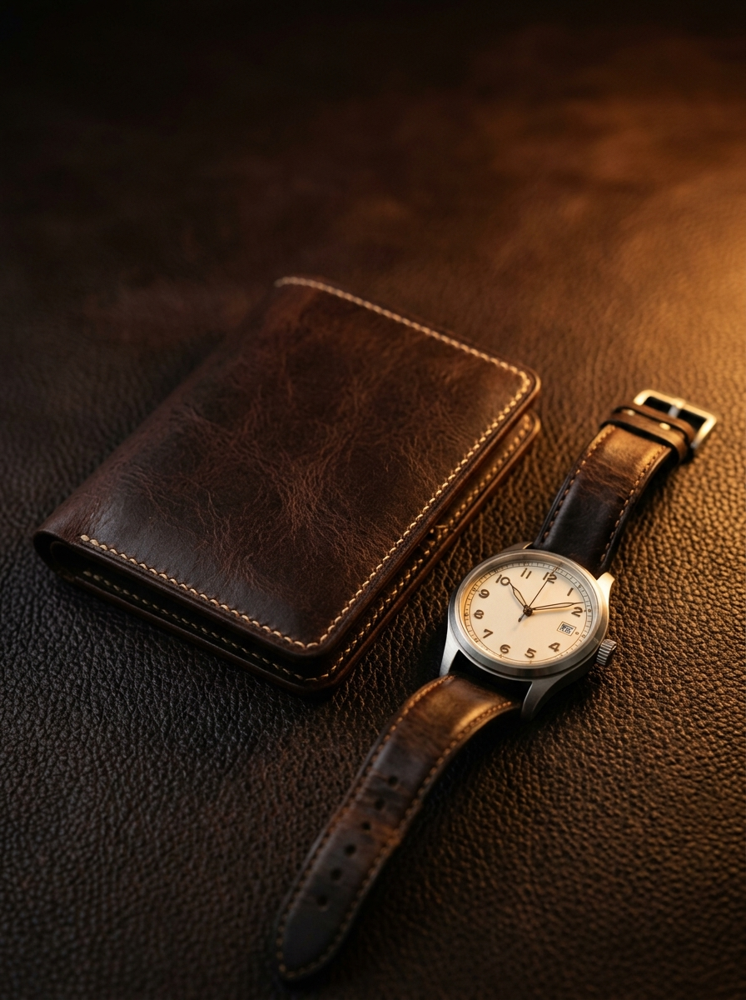
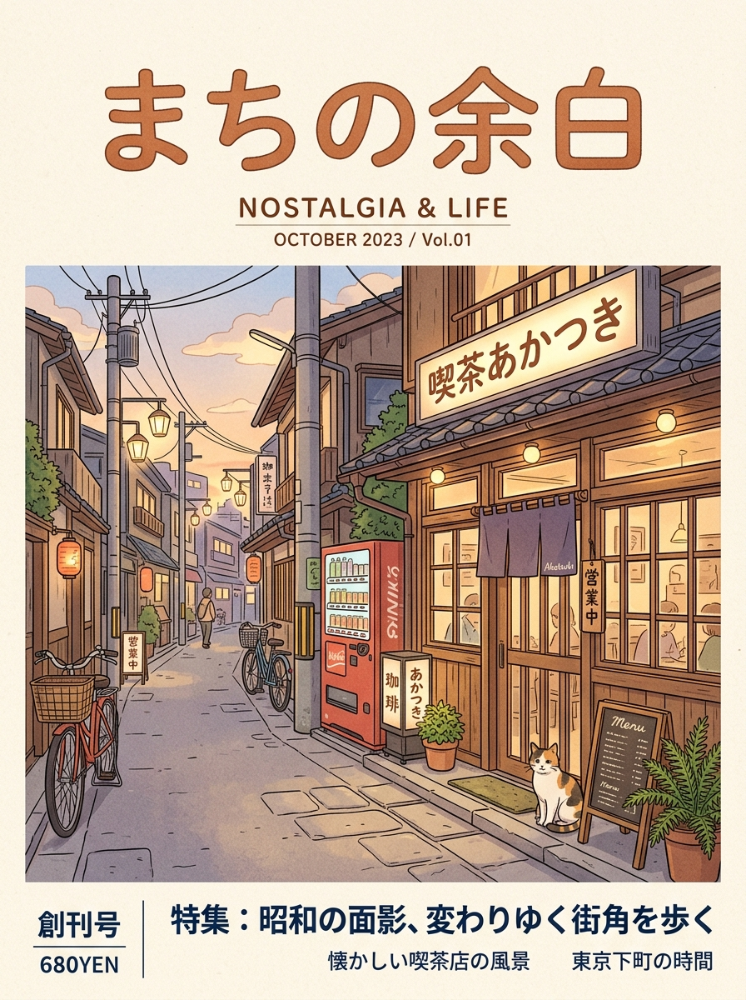
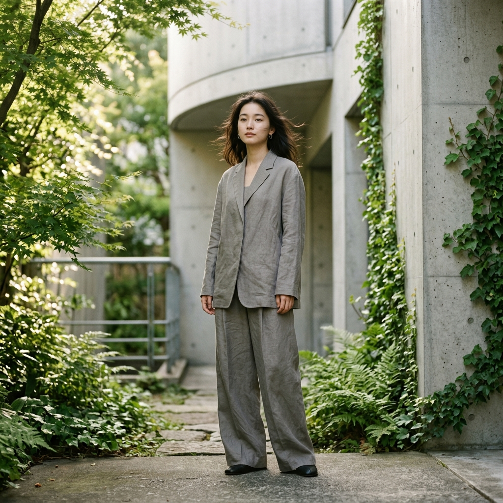
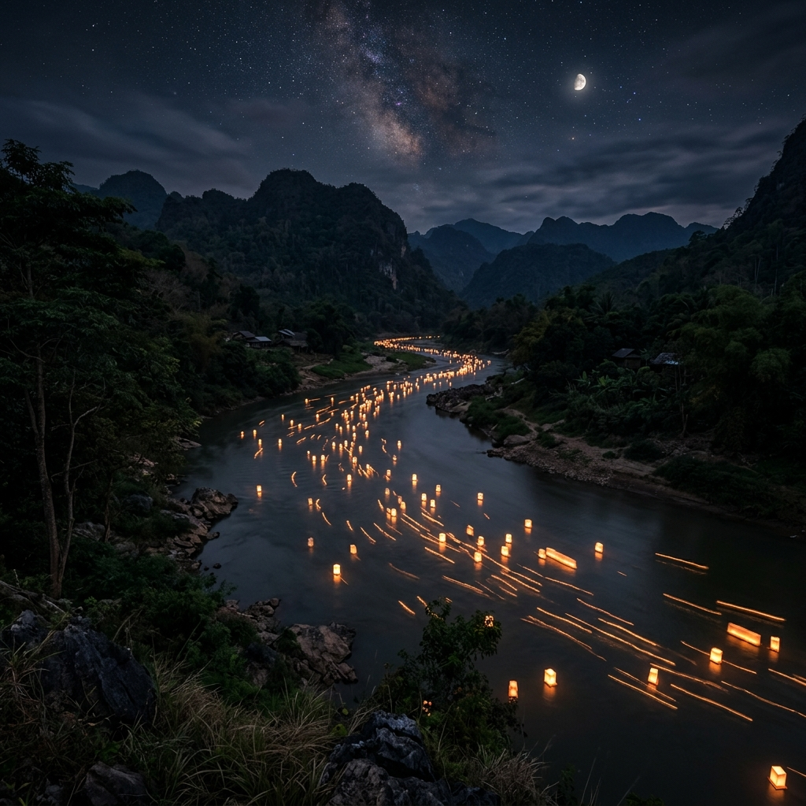
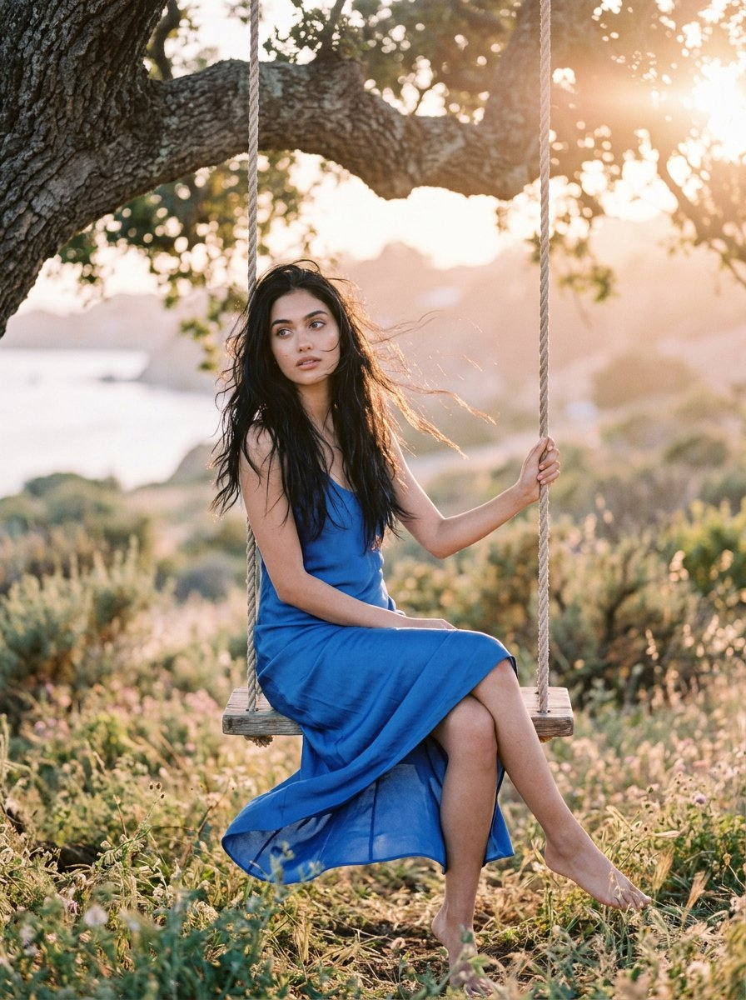

# Nano Banana · 프롬프트 라이브러리 · Leadde.ai

[](README.md) [](README_zh.md) [](README_zh-TW.md) [](README_ja-JP.md) [](README_ko-KR.md) [](README_th-TH.md) [](README_vi-VN.md) [](README_hi-IN.md) [](README_es-ES.md) [-lightgrey)](README_es-419.md) [](README_de-DE.md) [](README_fr-FR.md) [](README_it-IT.md) [-lightgrey)](README_pt-BR.md) [](README_pt-PT.md) [](README_tr-TR.md)

**Best for:** Nano Banana prompts for reference-image editing, product consistency, character continuity, and rapid iteration.

For PDF, PPT, SOP, training, and multilingual video workflows:
[Awesome Document-to-Video](https://github.com/LeaddeOpenLab/awesome-document-to-video)

> **매일 엄선하는 고품질 프롬프트**

AI 이미지, 영상, 3D 제작을 위한 완전한 프롬프트를 찾아보세요. 스타일별 분류, 다국어 버전, 원작자와 출처를 제공합니다.

[Leadde.ai 살펴보기 →](https://leadde.ai/?utm_source=github&utm_medium=readme&utm_campaign=prompt-library&utm_content=nano-banana)

## Leadde.ai 소개

Leadde.ai는 문서, 슬라이드, 텍스트를 교육, 온보딩, 마케팅용 AI 비즈니스 영상으로 만드는 팀을 돕습니다.

저장소에 별을 눌러 매일 엄선한 프롬프트와 새로운 창작 아이디어를 확인하세요.

**17** 개 · 최근 추가: **2026-09-10**

<a name="catalog"></a>

## 카테고리 탐색

[사진술](#category-photography) · [시네마틱 / 영화 스틸컷](#category-cinematic-film-still) · [3D 렌더링](#category-3d-render) · [레트로 / 빈티지](#category-retro-vintage) · [사이버펑크 / SF](#category-cyberpunk-sci-fi) · [기타](#category-other)

<a name="all-prompts"></a>

<a name="category-photography"></a>

## 사진술

<a name="prompt-2097623415939076175"></a>

### 고급 가죽 제품 및 손목시계 캠페인 사진을 위한 프롬프트 템플릿. 묵직한 조명과 장인정신 디테일을 강조한 정물 구도를 지정.

작성자：[@AIGuideNote](https://x.com/AIGuideNote) · [원본 게시물](https://x.com/AIGuideNote/status/2097623415939076175)

포스터 / 전단지 · 사진술 · 제품 · 배포 완료

**요약:** 고급 가죽 제품 및 손목시계 캠페인 사진을 위한 프롬프트 템플릿. 묵직한 조명과 장인정신 디테일을 강조한 정물 구도를 지정.



**프롬프트**

```text
【상품 및 캠페인 정보】
・어필 텍스트: {goldText}
・브랜드 카피: {subtext}
・대상 제품: {products}

【화질·연출·구도 지정】
・스타일: 최고급 하이엔드 브랜드 카탈로그 또는 럭셔리 매거진 펼침면 스타일의 정물(스틸라이프) 제품 사진.
・피사체: 깊이감 있는 빈티지 가죽이나 고급스러운 다크 톤 텍스처 위에 배치된 {products}. 장인의 수작업이 느껴지는 디테일(스티치, 금속의 헤어라인 가공 등)이 아름답고 풍성하게 묘사됨.
・조명 및 색채: 깊이 있는 다크 브라운, 블랙, 황동 골드를 기조로 한 컬러 팔레트. 앰버 톤의 따뜻한 사이드 라이트, 클래식하고 묵직한 섀도.
・텍스트 배치 (GPT-image / Nano Banana Pro용): 골드 컬러의 얇은 폰트로, {goldText} 및 {subtext} 텍스트가 화면의 차분하고 정돈된 위치에 은은한 타이포그래피로 배치됨.

【레이아웃 및 출력 관련 엄격한 제한 사항 (필수)】
・완성된 디자인 자체를 화면 전체에 꽉 차게 출력해 주십시오. 디자인 내부의 배경이나 장면 묘사(벽, 공간, 그림자 등)는 본문의 지시를 따라도 무방합니다.
・금지 사항: 완성된 포스터를 액자에 넣은 사진, 벽에 붙여놓은 상태의 사진, 책상이나 종이 위에 올려둔 목업 사진, 종이 가장자리의 원근 왜곡 및 드롭 섀도.
・Output the finished flat 2D design itself, filling the entire canvas. Scene elements inside the design (walls, rooms, shadows) described above are allowed. Absolutely NO photo-of-a-poster mockups: no picture frames, no poster-on-wall or poster-on-desk shots, no perspective warp or drop shadow around the artwork's edges.

・종횡비: --ar 3:4
```

[↑ 카테고리로 돌아가기](#catalog)

---

<a name="prompt-2097600395073966528"></a>

### 황혼의 주유소 옆에서 아우디 세단에 기대어 선 근육질 남성의 초상화, 배경에는 눈 덮인 산.

작성자：[@pictsbyai](https://x.com/pictsbyai) · [원본 게시물](https://x.com/pictsbyai/status/2097600395073966528)

사진술 · 인물 사진 / 셀카 · 캐릭터 · 풍경 / 자연 · 초록 / 배경 · 배포 완료

**요약:** 황혼의 주유소 옆에서 아우디 세단에 기대어 선 근육질 남성의 초상화, 배경에는 눈 덮인 산.


**프롬프트**

```text
자신감 넘치고 근육질인 청년이 프레임 중앙에 서서 부드러운 다문 미소와 편안한 눈썹으로 카메라를 똑바로 응시하고 있으며, 질감 있는 웨이브 가르마 머리가 밝은 하이라이트를 반사하고 있다. 그는 몸에 딱 맞는 검은색 티셔츠와 검은색 바지를 입고 근육을 돋보이게 하기 위해 의도적으로 가슴 앞에 팔짱을 끼고 포즈를 취하고 있다. 그의 왼손은 손가락을 살짝 구부린 채 오른쪽 이두근 위에 자연스럽게 얹혀 있으며 굵은 은색 체인 팔찌가 뚜렷하게 보인다. 그는 전경에 위치한 깨끗하고 윤기 나는 검은색 아우디 세단에 카메라를 향해 기대어 있으며, 앞쪽 펜더에는 S-line 엠블럼이 보인다. 중경 우측에는 흰색과 노란색 케이스에 초록색과 검은색 노즐이 달린 낡은 주유기가 짙은 회색 콘크리트 바닥 위에 서 있다. 그의 머리 위에는 수평 리브가 있는 무광택 연베이지색 금속 패널과 밝은 사각형 매립형 조명이 설치된 풍화된 산업용 캐노피 지붕이 있다. 깊은 배경에는 희끗희끗 눈이 덮인 웅장하고 가파른 바위 봉우리들이 공간적 깊이감 속에서 실루엣을 이루고 있다. 장면은 짙푸른 황혼 하늘 아래 고대비의 분위기 있는 공기로 둘러싸여 있으며, 짙은 검정과 황혼의 파란색으로 이루어진 차가운 분할 보색 팔레트가 주를 이루고 따뜻한 황백색 액센트가 이를 관통한다. 캐노피에서 나오는 방향성이 강하고 거친 조명이 황혼의 환경광과 섞여 그의 턱 아래, 팔 아래, 자동차 밑으로 깊고 뚜렷한 검은 그림자를 드리우는 한편, 광대뼈, 콧대, 자동차 보닛 위로 강렬한 하이라이트를 반사한다. 35mm 렌즈, f/2.8, ISO 800, 1/125초로 촬영된 사실적인 디지털 사진인 이 매우 선명한 인물 사진은 영화 같은 자동차 미학과 현대 소셜 미디어 라이프스타일 영향을 조화시키고, 차가운 그림자, 얼굴의 은은한 닷징, 자동차 반사광의 하이라이트 리프팅으로 완성도를 높였으며, 3:4 화면비로 아름답게 담아냈다.
```

[↑ 카테고리로 돌아가기](#catalog)

---

<a name="prompt-2097478436105384108"></a>

### 따뜻한 크림색 배경의 짙은 갈색 흙 속에 있는 핸드메이드 매트 클레이 코랄 핑크 코스모스 꽃을 다루며, 정밀한 좌표, 카메라 각도, 점토 질감 디테일을 명시한 스톱모션 레퍼런스 사진 프롬프트.

작성자：[@higgsfield](https://x.com/higgsfield) · [원본 게시물](https://x.com/higgsfield/status/2097478436105384108)

사진술 · 배포 완료

**요약:** 따뜻한 크림색 배경의 짙은 갈색 흙 속에 있는 핸드메이드 매트 클레이 코랄 핑크 코스모스 꽃을 다루며, 정밀한 좌표, 카메라 각도, 점토 질감 디테일을 명시한 스톱모션 레퍼런스 사진 프롬프트.


**프롬프트**

```text
스토리보드가 아닌 정사각형 스톱모션 레퍼런스 사진 한 장을 제작하세요: 따뜻한 크림색 배경을 바탕으로 짙은 갈색 흙 속에 있는 핸드메이드 매트 클레이 코랄 핑크 코스모스 꽃. 정면 낮은 앵글 고정 카메라, 70mm 매크로, 직교 감각. 흙은 하단 22%를 채우며 (50%,79%)에서 정점을 이룹니다. 중앙에 위치한 줄기는 (50%,80%)에서 꽃 중심점인 (50%,33%)까지 이어집니다. 정확히 두 장의 녹색 잎과 정확히 10개의 코랄 꽃잎 및 질감 있는 황금빛 중심을 가진 35% 너비의 꽃 머리를 추가하세요. 은은한 지문, 흙 부스러기, 몇 개의 조약돌을 포함합니다. 부드러운 좌측 상단 조명과 고정된 그림자를 사용하세요. 애니메이션 작업을 위해 카메라와 흙을 고정한 상태로 꽃 전체가 보이도록 유지하세요. 화분, 추가 식물, 캐릭터, 곤충, 손, 텍스트, 워터마크, 테두리, 격자 없음.
```

[↑ 카테고리로 돌아가기](#catalog)

---

<a name="prompt-2097238007426490758"></a>

### 해안가 황혼 무렵 인피니티 풀 옆에 단추를 푼 검은 셔츠와 선글라스를 착용하고 서 있는 스타일리시한 태닝 남성의 고급스러운 라이프스타일 플래시 사진.

작성자：[@pictsbyai](https://x.com/pictsbyai) · [원본 게시물](https://x.com/pictsbyai/status/2097238007426490758)

사진술 · 인물 사진 / 셀카 · 캐릭터 · 배포 완료

**요약:** 해안가 황혼 무렵 인피니티 풀 옆에 단추를 푼 검은 셔츠와 선글라스를 착용하고 서 있는 스타일리시한 태닝 남성의 고급스러운 라이프스타일 플래시 사진.


**프롬프트**

```text
윤기 나는 그을린 피부를 지닌 잘생긴 젊은 남성이 가슴을 펴기 위해 어깨를 편안하게 뒤로 젖힌 채, 자신감 있고 격식 있는 자세로 카메라를 정면으로 응시하고 있다. 그는 단추를 푼 검은색 롱슬리브 셔츠와 은색 체인 목걸이, 눈을 완전히 가리는 검은색 웨이페어러 스타일 선글라스를 착용하여 진지하고 중립적인 표정과 완벽한 조화를 이룬다. 그의 갈색 중간 길이 머리는 목덜미까지 닿아 귀 뒤로 깔끔하게 넘긴 슬릭백 플로우 스타일로 연출되었으며, 앞머리 퀴프에는 적당한 볼륨감을 주고 옆머리는 차분하게 가라앉혔다. 짙은 블론드와 갈색 뿌리에서 밝은 블론드 끝부분으로 이어지는 모발은 강한 웨트 룩 포마드로 단단히 고정되어 윤기 있고 구조감 있는 질감을 드러내며, 살짝 갈라진 머릿단, 헤어라인의 자연스러운 불규칙함, 머리 오른쪽에 살짝 보이는 잔머리가 돋보인다. 하체 상단에서는 두 손이 편안한 방식으로 부드럽게 맞잡혀 있다. 왼손은 손가락을 자연스럽게 안쪽으로 말아 아래에 받치고, 오른손은 왼손 마디를 가볍게 쥐어 은반지와 은색 체인 팔찌를 드러낸다. 그는 대각선으로 깔린 바랜 웜 그레이와 갈색 목재 데크 위에 서 있으며, 중경에는 선명한 황혼의 하늘과 그의 어두운 의상을 반사하는 맑고 짙은 물의 인피니티 풀이 자리한다. 중경 우측에는 난간 동자가 있는 클래식한 석조 발코니 난간이 물을 배경으로 실루엣을 이루며, 전경 상단에는 소나무 가지가 프레임 안으로 가볍게 늘어져 어두운 솔잎이 플래시 빛의 가장자리를 은은하게 머금고 있다. 깊은 원경은 분위기 있는 황혼 하늘을 배경으로 어두운 실루엣의 언덕들이 솟아 있는 광활한 해안 풍경으로 이어지며, 맨 왼쪽 해안가에는 흩어진 해안가 건물 불빛들이 부드럽게 반짝인다. 장면은 복합 조명으로 비추어지며, 피사체에 높은 지향성의 따뜻한 골든 라이트를 던져 이마, 콧대, 광대뼈, 가슴, 손, 금속 장신구에 밝은 정반사 하이라이트를 만들어내는 하드하고 직접적인 온카메라 플래시가 특징이다. 이 거친 플래시는 턱 아래, 셔츠 주름 안쪽, 맞잡은 손 아래에 짙고 짧으며 팽팽한 그림자를 드리워, 마젠타 퍼플빛 일몰의 온기에서 짙은 다크 네이비 블루 밤하늘로 부드럽게 전환되는 배경의 무드 있고 로우키한 앰비언트 황혼과 극적인 대비를 이룬다. 웜톤 플래시 컬러와 쿨하고 채도 낮은 대기 중의 블루 및 퍼플이 이루는 분할 보색 팔레트는 신비롭고 프라이빗한 럭셔리 리조트 분위기를 자아낸다. 하이엔드 파파라치 라이프스타일 이미지의 사실적인 디지털 사진 스타일로 담아낸 이 컷은 35mm에서 50mm 상당의 렌즈를 사용하여 눈높이에서 정면으로 촬영되었으며, 약 1/60초의 드래그 셔터를 사용하여 매우 또렷한 피사체와 약간 부드럽고 디지털 노이즈가 낀 저조도 배경의 균형을 맞춘다. 후처리는 높은 대비를 위해 블랙을 살짝 눌러주고 피사체의 얼굴과 장신구의 선명도와 명료성을 극대화하여, 인상적인 전체 구도를 3:4 세로 인물 사진 포맷으로 담아냈다.
```

[↑ 카테고리로 돌아가기](#catalog)

---

<a name="category-cinematic-film-still"></a>

## 시네마틱 / 영화 스틸컷

<a name="prompt-2097564694974541836"></a>

### 도시적인 환경에서 영화 같고 극사실적인 스트리트웨어 에디토리얼 인물 사진을 제작합니다.

작성자：[@shushant\_l](https://x.com/shushant_l) · [원본 게시물](https://x.com/shushant_l/status/2097564694974541836)

시네마틱 / 영화 스틸컷 · 인물 사진 / 셀카 · 도시 풍경 / 거리 · 배포 완료

**요약:** 도시적인 환경에서 영화 같고 극사실적인 스트리트웨어 에디토리얼 인물 사진을 제작합니다.


**프롬프트**

```text
나의 정확한 얼굴 이목구비, 특징, 피부 톤, 헤어스타일, 자연스러운 신체 비율을 그대로 유지하면서 영화 같고 극사실적인 스트리트웨어 에디토리얼 인물 사진을 만들어 주세요. 오버사이즈 레이어드 의상과 은은한 액세서리로 프리미엄 모던 스트리트웨어를 스타일링하고, 콘크리트 건축물, 질감이 살아있는 벽, 절제된 도시적 디테일이 있는 도시 환경에서 자신감 있고 편안한 포즈를 취하게 해주세요. 드라마틱한 자연광, 부드러운 그림자, 얕은 심도, 사실적인 피부 질감, 세련된 뉴트럴 톤, 은은한 필름 그레인, 하이패션 매거진 구도, 전문 사진 기법, 시네마틱 컬러 그레이딩을 사용하세요. 풀프레임 카메라에 85mm 렌즈로 촬영한 럭셔리 스트리트웨어 캠페인처럼 사실적이고, 자연스럽게 멋지며, 미니멀하고 감각적이며 에디토리얼한 느낌을 연출해 주세요.
```

[↑ 카테고리로 돌아가기](#catalog)

---

<a name="prompt-2097549831489405424"></a>

### 호수, 선착장의 여행자, 매거진 타이포그래피가 포함된 시네마틱 9:16 알파인 여행 포스터 프롬프트.

작성자：[@aniyaintel](https://x.com/aniyaintel) · [원본 게시물](https://x.com/aniyaintel/status/2097549831489405424)

포스터 / 전단지 · 시네마틱 / 영화 스틸컷 · 풍경 / 자연 · 텍스트 / 타이포그래피 · 배포 완료

**요약:** 호수, 선착장의 여행자, 매거진 타이포그래피가 포함된 시네마틱 9:16 알파인 여행 포스터 프롬프트.


**프롬프트**

```text
9:16 세로 비율의 프리미엄 극사실주의 시네마틱 여행 에디토리얼 포스터를 제작하세요.

장면: 투명하고 맑은 청록색 물이 흐르는 숨막히게 아름다운 고산 호수로, 극적인 만년설 산맥, 울창한 상록 소나무 숲, 가파른 암벽으로 둘러싸여 있습니다. 호수는 산과 하늘을 완벽하게 반사합니다. 오른쪽 해안가 근처에는 소박한 작은 통나무 오두막이 자리 잡고 있으며, 전경의 나무 선착장 옆에는 전통 목선 조각배가 묶여 있습니다.

중앙 전경에는 나무 선착장에 등을 카메라로 향한 채 앉아 평화롭게 산을 바라보는 홀로 여행자가 있습니다. 여행자는 갈색 챙이 넓은 모자, 번트 오렌지색 아웃도어 재킷, 베이지/갈색 하이킹 백팩, 뉴트럴 톤의 아웃도어 의류를 착용하고 있습니다. 자연스럽고 사실적인 비율과 섬세한 옷의 질감이 돋보입니다.

구도: 시네마틱 광각 촬영, 여행자는 하단 중앙에 위치하고 보트는 하단 오른쪽에 배치되며 넓은 호수와 산맥이 배경을 지배합니다. 강한 원근감, 자연스러운 투시, 레이어드된 풍경, 평화롭고 모험적인 분위기.

조명: 부드러운 아침의 황금빛 햇살, 뭉게구름이 흩뿌려진 밝은 푸른 하늘, 산 주변의 은은한 대기 안개, 사실적인 햇살과 자연스러운 그림자. 청록색 물, 대지의 갈색 전경, 울창한 녹색 숲, 시원한 푸른 산 등 풍부하면서도 진정성 있는 색감.

타이포그래피: 이미지 상단에 우아한 여행 포스터 타이포그래피를 추가하세요:

작은 대문자 텍스트: “COLLECT”
크고 스타일리시한 필기체/스크립트 텍스트: “Moments”
그 아래 중간 크기 대문자 텍스트: “NOT THINGS”
작은 하트 기호가 들어간 미니멀한 장식용 가로선
작은 대문자 태그라인: “TRAVEL • EXPLORE • LIVE”

세련된 다크 틸(청록색) 타이포그래피, 깔끔한 자간, 프리미엄 에디토리얼 디자인, 균형 잡힌 위계 구조, 높은 가독성의 텍스트, 감각적이고 미니멀한 장식을 적용하세요.

스타일: 럭셔리 여행 매거진, 시네마틱 포토그래피, 극도로 정밀한 디테일, 사실적 표현, 전문가급 DSLR 촬영, HDR, 사실적인 수면 반사, 자연스러운 피부 및 의류 질감, 은은한 필름 느낌의 컬러 그레이딩, 대기 원근감, 프리미엄 핀터레스트 여행 감성, 영감을 주며 평화로운 무드.

제외 사항: 왜곡된 인물, 불필요한 사지, 비현실적인 건축물, 과도한 채도, 흐릿한 디테일, 만화 같은 외형, 가짜 같은 물 표현, 조잡한 타이포그래피, 로고, 워터마크.
```

[↑ 카테고리로 돌아가기](#catalog)

---

<a name="prompt-2097524090735075539"></a>

### 따스한 골든 아워의 조명 속에서 거대하고 선명한 붉은 양귀비꽃에 둘러싸인 우아한 여성을 묘사한 하이엔드 시네마틱 패션 포트레이트 프롬프트.

작성자：[@codewithhajra](https://x.com/codewithhajra) · [원본 게시물](https://x.com/codewithhajra/status/2097524090735075539)

사진술 · 시네마틱 / 영화 스틸컷 · 인물 사진 / 셀카 · 캐릭터 · 패션 아이템 · 배포 완료

**요약:** 따스한 골든 아워의 조명 속에서 거대하고 선명한 붉은 양귀비꽃에 둘러싸인 우아한 여성을 묘사한 하이엔드 시네마틱 패션 포트레이트 프롬프트.


**프롬프트**

```text
몽환적인 에디토리얼 정원을 배경으로, 거대하고 선명한 붉은 양귀비꽃들에 둘러싸인 우아한 성인 여성을 담아낸 숨이 멎을 듯한 극사실주의 시네마틱 패션 포트레이트. 그녀는 현실적이고 자연스러운 결을 지닌 맑고 환한 피부, 은은하게 붉어진 뺨, 정교하고 대칭적인 이목구비, 표현력이 풍부한 밝은 블루그레이 눈동자, 섬세한 눈썹, 또렷한 속눈썹, 우아하고 곧은 코, 그리고 자연스럽게 도톰하고 윤기 있는 누드 핑크빛 입술을 지니고 있다. 그녀의 표정은 차분하고 평온하며 은은한 매혹을 풍기며 카메라를 똑바로 응시한다.
길고 윤기 나는 골든 블론드 헤어는 단정하게 가르마를 타 매끄럽게 뒤로 넘겨져 있으며, 가느다란 머리카락 한 올 한 올이 햇빛을 받아 반짝인다. 거대한 진홍빛 양귀비꽃들이 그녀의 얼굴 왼쪽을 감싸며 머리 일부를 살짝 덮고 있으며, 전경과 배경을 채운 과장된 크기의 붉은 꽃들이 드라마틱한 플로럴 구도를 완성한다.
그녀는 가벼운 플리츠 시폰/튤 소재로 제작된 정교하고 부드러운 블러시 핑크 오트쿠튀르 드레스를 입고 있다. 드레스는 목을 감싸는 빅토리아 양식에서 영감을 받은 과장된 하이 러플 칼라, 정교한 수직 주름, 볼륨감 있는 조각 같은 숄더, 그리고 프레임 하단으로 아름답게 흘러내리는 반투명한 패브릭 레이어가 특징이다. 섬세한 패브릭은 햇빛을 받아 부드러운 하이라이트, 그림자, 주름 및 은은한 시스루 투명감을 연출한다.
따스한 골든 아워의 햇살이 그녀의 얼굴을 옆에서 비추며 화사한 피치 핑크빛 분위기, 피부의 빛나는 하이라이트, 부드러운 얼굴의 음영, 그리고 꽃에서 반사되는 풍부한 붉은빛을 자아낸다. 그녀의 뒤로는 부드럽게 흐려진 지평선과 끝없이 펼쳐진 붉은 꽃밭 위로 맑은 파스텔 블루빛 하늘이 펼쳐져 있다.
구도: 클로즈업에서 미디엄 패션 포트레이트, 중앙에 위치한 얼굴, 수직 4:5 프레이밍, 피사체를 드라마틱하게 감싸는 꽃들, 얕은 심도, 공간감을 위해 부드럽게 아웃포커스된 전경의 꽃잎들, 피사체와 배경 사이의 시네마틱한 분리감.
스타일: 하이엔드 럭셔리 패션 에디토리얼, 몽환적이고 로맨틱한 파인 아트 사진, 사실적인 묘사, 세련된 컬러 그레이딩, 자연스러운 피부 질감, 사실적인 패브릭 물리 표현, 정교한 꽃의 디테일, 부드러운 대기 원근감, 영화 같은 조명, 미세한 필름 그레인, HDR, 8K 디테일, 85mm 인물 렌즈, f/1.8, 전문 스튜디오 품질의 사진.
네거티브 프롬프트: 카툰, 애니메이션, 일러스트레이션, 플라스틱 같은 피부, 과도한 메이크업, 왜곡된 얼굴, 비대칭 눈, 기형 손, 추가적인 손가락, 중복된 꽃, 부자연스러운 머리카락, 과포화된 색상, 흐릿한 얼굴, 저해상도, 거친 그림자, 인위적인 피부, 텍스트, 워터마크, 로고.
```

[↑ 카테고리로 돌아가기](#catalog)

---

<a name="prompt-2097237465887338994"></a>

### 제목: 프리미엄 스파클링 레몬 드링크 제품 광고 스토리보드 포맷: • 단일 페이지 프리미엄 스토리보드 • 3:4 세로 비율 • 럭셔리 음료 캠페인 • 제품 중심의 영화 같은 8개 장면 • 제품이 항상 시각적 주인공으로 유지됨 • 하이엔드 상업 광고 프레젠테이션

작성자：[@Strength04\_X](https://x.com/Strength04_X) · [원본 게시물](https://x.com/Strength04_X/status/2097237465887338994)

만화 / 스토리보드 · 제품 마케팅 · 시네마틱 / 영화 스틸컷 · 인물 사진 / 셀카 · 제품 · 음식 / 음료 · 배포 완료

**요약:** 제목: 프리미엄 스파클링 레몬 드링크 제품 광고 스토리보드 포맷: • 단일 페이지 프리미엄 스토리보드 • 3:4 세로 비율 • 럭셔리 음료 캠페인 • 제품 중심의 영화 같은 8개 장면 • 제품이 항상 시각적 주인공으로 유지됨 • 하이엔드 상업 광고 프레젠테이션


**프롬프트**

```text
제목:
프리미엄 스파클링 레몬 드링크 제품 광고 스토리보드

포맷:
• 단일 페이지 프리미엄 스토리보드
• 3:4 세로 비율
• 럭셔리 음료 캠페인
• 제품 중심의 영화 같은 8개 장면
• 제품이 항상 시각적 주인공으로 유지됨
• 하이엔드 상업 광고 프레젠테이션

헤더:
• 볼드한 현대적 타이포그래피
• 정보 카드:
  - 재생 시간: 20초
  - 스타일: 고속 시네마틱 음료 광고
  - 제품: 스파클링 레몬 드링크
  - 오디오: 탄산 기포음 + 얼음 깨지는 소리 + 액체 ASMR
• '이 스타일이 효과적인 이유' 섹션
• 크리스털 화이트, 레몬 옐로우, 실버의 에스테틱
• 시트러스에서 영감을 받은 미니멀한 그래픽 포인트

스토리보드:
1. 짙은 물방울이 맺힌 채 홀로 서 있는 차가운 병
2. 병을 타고 흘러내리는 물방울의 익스트림 매크로
3. 병뚜껑이 열리며 드라마틱하게 분출되는 탄산
4. 절제된 액체 스플래시와 함께 위로 폭발하듯 솟구치는 스파클링 음료
5. 탄산 액체 속을 회전하며 통과하는 레몬 슬라이스
6. 크리스털 유리잔에 울트라 슬로우 모션으로 떨어지는 각얼음
7. 음료를 뚫고 피어오르는 수천 개의 탄산 방울을 보여주는 익스트림 매크로
8. 병, 유리잔, 레몬 슬라이스, 그리고 제품을 둘러싼 정지된 스플래시가 어우러진 최종 히어로 팩샷

모든 패널:
• 장면 번호
• 재생 시간 배지
• 카메라 연출
• 비주얼
• 액션
• 제품 디테일

카메라:
120fps 고속 액체 촬영, 익스트림 매크로, 정지된 스플래시, 회전하는 레몬 슬라이스, 드라마틱한 역광, 결로 클로즈업, 부드러운 360° 제품 회전 무빙.

스타일:
초현실적 프리미엄 음료 광고, 크리스털처럼 투명한 액체, 폭발적인 탄산, 물리적으로 정확한 물방울
```

[↑ 카테고리로 돌아가기](#catalog)

---

<a name="category-3d-render"></a>

## 3D 렌더링

<a name="prompt-2097629839209758892"></a>

### 유명 사상가들을 기리는 3D 대리석 신전 디오라마의 2x2 그리드를 위한 의사코드 스타일 프롬프트.

작성자：[@Gdgtify](https://x.com/Gdgtify) · [원본 게시물](https://x.com/Gdgtify/status/2097629839209758892)

3D 렌더링 · 배포 완료

**요약:** 유명 사상가들을 기리는 3D 대리석 신전 디오라마의 2x2 그리드를 위한 의사코드 스타일 프롬프트.


**프롬프트**

```text
2x2 그리드, 16:9, 유명한 사상가, 작가, 발명가 4인을 위해 다음을 수행: class Mind_As_Shrine_Diorama:
    def __init__(self, thinker="[THINKER_NAME]"):
        self.canvas = "순백의 스튜디오 배경 위 단일하고 독립적인 3D 기념비적 조각 비네트."
        self.material_palette = "광택이 나는 백색 카라라 대리석, 브러시드 황동, 유리 렌즈, 그리고 빛나는 우주의 풍경."

    def construct_face_and_hair_arch(self):
        # 핵심 시각적 언어유희: 머리카락이 건축물이 됨
        hair_motif = infer_iconic_hair_or_silhouette(self.thinker)
        name_arch = f"과장된 {hair_motif}을(를) 나타내는 화려한 바로크 양식의 소용돌이치는 구름 아치형 통로에 직접 통합된, '{self.thinker.upper()}' 철자의 거대한 3D 금박 대리석 글자들."
        face_core = f"중앙: 석재 바닥에서 솟아오르는 정교하게 조각된 {self.thinker}의 사실적인 대리석 얼굴, 유리 렌즈에 주요 공식/기호가 표시된 원형 안경 착용."
        return [name_arch, face_core]

    def construct_internal_brain_chambers(self):
        # AI 자동 추론: 그들의 지적 유산을 두 개의 별도 방으로 분할
        theory_left = infer_primary_breakthrough(self.thinker) # 예: 특수 상대성 이론, 논리 게이트, 자연선택설
        theory_right = infer_secondary_breakthrough(self.thinker) # 예: 일반 상대성 이론, 양자 상태, 광학
        
        chamber_left = f"좌측 상단 방: {theory_left}의 실제 방정식이 적힌 소형 칠판, 기계적 사고 실험 모델(예: 기차, 시계, 톱니바퀴), 그리고 작은 책들이 가득한 서재."
        chamber_right = f"우측 상단 방: 광학 기기, 원자 모델, 입체적인 중력 우물/깔때기를 갖추고 {theory_right}을(를) 보여주는 심우주 풍경."
        return [chamber_left, chamber_right]

    def construct_base(self):
        quote = infer_signature_quote(self.thinker)
        return f"황동 리벳이 박힌 계단식 원형 대리석 기단, 손글씨 텍스트가 적힌 펼쳐진 필사본, 그리고 다음이 새겨진 곡선형 황동 명판: '{quote}'."

render_sculptural_masterpiece(Mind_As_Shrine_Diorama())
```

[↑ 카테고리로 돌아가기](#catalog)

---

<a name="category-retro-vintage"></a>

## 레트로 / 빈티지

<a name="prompt-2097696144163778745"></a>

### 쇼와 레트로 거리 풍경과 오래된 다방을 그린, 손그림 스타일의 따스한 로컬 정보지 표지 디자인 프롬프트.

작성자：[@AIGuideNote](https://x.com/AIGuideNote) · [원본 게시물](https://x.com/AIGuideNote/status/2097696144163778745)

레트로 / 빈티지 · 도시 풍경 / 거리 · 배포 완료

**요약:** 쇼와 레트로 거리 풍경과 오래된 다방을 그린, 손그림 스타일의 따스한 로컬 정보지 표지 디자인 프롬프트.



**프롬프트**

```text
【매거진 정보】
・잡지명: {magazineTitle}
・이번 호 특집 테마: {featureTopic}
・호수 표기: {issueName}

【화질・연출・구도 지정】
・스타일: 일본의 레트로한 거리 풍경과 라이프스타일을 담아낸 부드러운 터치의 일러스트(『OZ magazine』이나 지자체 홍보지 스타일).
・피사체: 쇼와 레트로 감성이 남아있는 노스탤직한 상점가 골목 모퉁이, 오래된 킷사텐(다방), 골목길을 걷는 사람들, 혹은 고양이가 웅크리고 있는 풍경.
・색채・톤: 따뜻한 파스텔 컬러와 살짝 바랜 잉크 느낌. 손그림 스타일의 부드러운 텍스처.
・타이포그래피(GPT-image / Nano Banana Pro용): {magazineTitle} 잡지 로고가 상단에 크고 따뜻한 손글씨 느낌의 글자로 배치되고, 중앙이나 하단에 {featureTopic} 및 {issueName}이 깔끔하게 레이아웃되어 있음.

【레이아웃 및 출력에 관한 엄격한 제약(필수)】
・완성된 디자인 자체를 화면 전체에 꽉 차게 출력해 주세요. 디자인 내부의 배경이나 장면 묘사(벽, 공간, 그림자 등)는 본문의 지시를 따라도 무방합니다.
・금지 사항: 완성된 포스터를 액자에 넣은 사진, 벽에 붙인 상태의 사진, 책상이나 종이 위에 올려둔 목업 사진, 종이 가장자리의 원근 왜곡이나 드롭 섀도우.
・Output the finished flat 2D design itself, filling the entire canvas. Scene elements inside the design (walls, rooms, shadows) described above are allowed. Absolutely NO photo-of-a-poster mockups: no picture frames, no poster-on-wall or poster-on-desk shots, no perspective warp or drop shadow around the artwork's edges.

・종횡비: --ar 3:4
```

[↑ 카테고리로 돌아가기](#catalog)

---

<a name="category-cyberpunk-sci-fi"></a>

## 사이버펑크 / SF

<a name="prompt-2097435473043931201"></a>

### 거대하게 빛나는 우주 고리 성운 아래 구름 바다 위에 떠 있는 빛나는 도시들을 묘사한 프롬프트.

작성자：[@churvikv](https://x.com/churvikv) · [원본 게시물](https://x.com/churvikv/status/2097435473043931201)

사이버펑크 / SF · 배포 완료

**요약:** 거대하게 빛나는 우주 고리 성운 아래 구름 바다 위에 떠 있는 빛나는 도시들을 묘사한 프롬프트.


**프롬프트**

```text
Prompt 1:
마법 같은 밤하늘 아래 폭신한 밤 구름 바다 위에 떠 있는 도시 풍경을 묘사한 매혹적인 디지털 일러스트레이션. 전경에는 따뜻한 황금빛 불빛으로 창문이 밝혀진 우뚝 솟은 고층 빌딩들이 빽빽하게 밀집하여 눈부시게 빛나는 도시 스카이라인을 형성하고 있다. 도시는 저 멀리까지 뻗어나가는 짙푸른 색과 회색의 두껍게 일렁이는 구름 담요 위에 얹혀 있는 것처럼 보인다. 도시 위로 밤하늘은 천체의 경이로움으로 변모한다. 형형색색의 성운으로 이루어진 거대하고 빛나는 고리가 별들로 가득 찬 어두운 공허를 둘러싸고 있다. 성운은 짙은 보라색, 일렉트릭 블루, 불타는 주황색의 생생한 색조로 빛나며, 멀리서 반짝이는 별과 별자리들이 흩뿌려져 몽환적이고 이세계적인 분위기를 자아낸다.

Prompt 2:
황혼녘, 끝없이 펼쳐진 짙고 일렁이는 짙은 회색 구름 바다 위에 우아하게 떠 있는 미래 대도시의 숨 막히는 수직 뷰. 드넓게 펼쳐진 도시 스카이라인에는 빛나는 창문을 지닌 우뚝 솟은 수많은 초고층 빌딩들이 자리 잡고 있으며, 아래의 도시 풍경 위로 따뜻한 호박색과 주황색 불빛을 드리우고 있다. 프레임 상단을 지배하는 것은 장엄한 우주의 고리로, 칠흑 같은 밤하늘 전체에 수없이 반짝이는 별들과 먼 은하들이 흩뿌려진 채 선명한 보라색, 짙은 파란색, 찬란하고 따뜻한 황금빛 색조로 구성된 빛나는 원형 성운이다. 구도는 균형 잡히고 위엄이 있으며, 어두운 구름층이 하단 전경의 중심을 잡으며 상단의 찬란한 우주 현상과 뚜렷한 대비를 이룬다. 조명은 초현실적이고 천상의 느낌을 주며, 도시 불빛의 따뜻한 인공적인 빛과 성운의 우주적 발광이 조화를 이룬다. 분위기는 고요하고 경외감을 불러일으키며 신비로워, 성간의 경이로움과 도시의 고립감을 자아낸다. 부드럽고 풍성한 구름의 디테일한 질감, 초고층 빌딩의 매끄러운 유리 및 강철 건축물, 별빛 가득한 우주 먼지가 어우러져 대비가 강하고 시각적으로 강렬한 장면을 만들어낸다.
```

[↑ 카테고리로 돌아가기](#catalog)

---

<a name="category-other"></a>

## 기타

<a name="prompt-2097803184903274848"></a>

### 번역 중

작성자：[@AIGuideNote](https://x.com/AIGuideNote) · [원본 게시물](https://x.com/AIGuideNote/status/2097803184903274848)

인물 사진 / 셀카 · 패션 아이템 · 배포 완료

**요약:** 번역 중



**프롬프트**

```text
번역 중
```

[↑ 카테고리로 돌아가기](#catalog)

---

<a name="prompt-2097775925899436414"></a>

### 어두운 강 위에 떠 있는 종이등을 담은 장노출 밤 풍경.

작성자：[@dfl\_inc\_jp](https://x.com/dfl_inc_jp) · [원본 게시물](https://x.com/dfl_inc_jp/status/2097775925899436414)

풍경 / 자연 · 배포 완료

**요약:** 어두운 강 위에 떠 있는 종이등을 담은 장노출 밤 풍경.



**프롬프트**

```text
#걸작 #사실적인 사진 #풍경 #장노출 #물에 뜬 종이등 #어두운 물살 #따스한 반영 #자정의 고요함
```

[↑ 카테고리로 돌아가기](#catalog)

---

<a name="prompt-2097709112188641299"></a>

### 골든 아워에 그네를 타고 있는 파란색 실크 드레스를 입은 젊은 여성의 인물 사진.

작성자：[@dreamydigiarts](https://x.com/dreamydigiarts) · [원본 게시물](https://x.com/dreamydigiarts/status/2097709112188641299)

인물 사진 / 셀카 · 캐릭터 · 패션 아이템 · 배포 완료

**요약:** 골든 아워에 그네를 타고 있는 파란색 실크 드레스를 입은 젊은 여성의 인물 사진.



**프롬프트**

```text
이미지는 고해상도 전신 세로 파인 아트 인물 사진으로, Sony A1과 120mm 렌즈로 촬영되었으며, 따스한 골든 아워의 빛을 받으며 그네 위에서 위안을 찾고 있는 20대 초반의 나긋나긋한 슈퍼모델을 포착합니다. 부드럽고 몽환적인 파스텔 색조, 코발트 블루 실크 드레스 착용, 몽환적인 분위기, 바람에 흩날리는 긴 칠흑 같은 머리카락, 크고 표현력이 풍부한 짙은 갈색 눈, 살짝 벌어진 붉은 입술, 향수와 평화를 전하는 사색적인 시선, 따스한 분위기를 뚫고 지는 해의 마지막 햇살이 그녀의 흐트러진 머리카락 사이로 춤추듯 스며드는 고요한 순간 속 희미한 향수.
```

[↑ 카테고리로 돌아가기](#catalog)

---

<a name="prompt-2097547198523388128"></a>

### 번역 중

작성자：[@AIGuideNote](https://x.com/AIGuideNote) · [원본 게시물](https://x.com/AIGuideNote/status/2097547198523388128)

제품 마케팅 · 포스터 / 전단지 · 배포 완료

**요약:** 번역 중


**프롬프트**

```text
번역 중
```

[↑ 카테고리로 돌아가기](#catalog)

---

<a name="prompt-2097548956251168916"></a>

### 블랙 조각 의자에 앉아 블랙 드레스를 입은 우아한 여성의 하이패션 스튜디오 인물 사진.

작성자：[@Elvorya](https://x.com/Elvorya) · [원본 게시물](https://x.com/Elvorya/status/2097548956251168916)

인물 사진 / 셀카 · 캐릭터 · 패션 아이템 · 배포 완료

**요약:** 블랙 조각 의자에 앉아 블랙 드레스를 입은 우아한 여성의 하이패션 스튜디오 인물 사진.


**프롬프트**

```text
어두운 차콜 그레이 배경을 바탕으로 우아하게 앉아 있는 기품 있는 여성의 초현실적인 하이패션 스튜디오 인물 사진. 그녀는 은은하게 반짝이는 장식이 더해진 세련된 블랙 원숄더 새틴 드레스를 입고 있다. 매끄러운 스트레이트 다크 브라운 헤어는 어깨 뒤로 단정하게 넘겨져 있다. 세련되고 매혹적인 메이크업: 부드럽게 정돈된 눈썹, 스모키 브라운 아이섀도, 날렵한 아이라이너, 긴 속눈썹, 따뜻한 블러셔, 윤기 있는 자연스러운 피부, 그리고 촉촉한 누드 로즈 립. 그녀는 우아한 기하학적 실버 드롭 귀걸이, 여러 개의 섬세한 실버 반지, 슬림한 팔찌, 작은 이어 커프를 착용하고 있다.

포즈: 광택 있는 블랙 조각 의자에 앉아 한쪽 팔은 의자에 자연스럽게 걸치고 다른 한 손은 턱 아래로 우아하게 올려져 있으며 손가락은 편안하고 우아하다. 광택 있는 블랙 매니큐어로 정돈된 긴 손톱. 차분하고 자신감 있게 카메라를 응시하는 시선, 세련된 표정.

전문적인 럭셔리 뷰티 사진, 부드럽게 확산된 키 라이트, 은은한 림 라이트, 깊은 그림자, 고대비, 현실적인 피부 질감, 디테일한 이목구비, 세련된 에디토리얼 마감, 영화 같은 분위기, 선명한 초점, 85mm 인물 렌즈, 얕은 심도, 프리미엄 패션 매거진 미학, 실사적, 4K, 세로 구도.
```

[↑ 카테고리로 돌아가기](#catalog)

---

<a name="prompt-2097482618992570627"></a>

### 고대와 홀로그램의 날개를 지닌 우주적 용이 현대 네온 도시 위를 맴도는 시적인 프롬프트.

작성자：[@ToshiArte](https://x.com/ToshiArte) · [원본 게시물](https://x.com/ToshiArte/status/2097482618992570627)

동물 / 생명체 · 배포 완료

**요약:** 고대와 홀로그램의 날개를 지닌 우주적 용이 현대 네온 도시 위를 맴도는 시적인 프롬프트.


**프롬프트**

```text
날개가 두 해안을 기억하는 곳

용은 세기를 선택하지 않는다.
유예와 잔광으로 빚어진 몸을 통해
스스로를 선택하는 세기 그 자체이다.
한쪽 날개는 종이가 자신의 이름을 배우기 전에 무너져 내린
도서관의 타지 않은 마지막 페이지를 끌고 간다.
다른 쪽 날개는 바로 서 있을지 혹은 소문이 될지
아직 결정을 내리지 못한 탑들로부터
홀로그램 비를 빗어낸다.
그 둘 사이에서 공기는 두 개의 달력을 품은 채
어느 쪽이 흐르고 있는지 잊어버린다.
그 비늘은 '비늘'이라는 단어보다 더 오래되었다.
그것들은 아직 지펴지지 않은 대장간의 열기와,
어떤 다른 이야기 속에서
이미 꺼져버린 별들의 차가움을 기억한다.
룬 문자는 도시가 생각할 권리를 아직 얻지 못한 생각들처럼
떠올랐다 가라앉는다.
빛의 맥박 하나하나는 유물이자 원형이다.
그 아래, 거리는 이미 일어난 일들과
여전히 도달을 협상 중인 일들로 젖어 있다.
네온은 한때 빙하의 인내였으며,
훗날에는 오직 갈증의 소문으로만 남을 물 위에 글을 쓴다.
주춧돌은 여전히 자신이 서 있다고 꿈꾸는
숲의 고요 위에 얹혀 있다.
광고판은 아직 찾아오지 않은 황혼을 벌써 그리워하는
내일들을 광고한다.
그 생물의 두 눈은 유일하게 정직한 날씨를 품고 있다.
한쪽은 아직 끝나지 않았음을 모르는 기억의 초록빛,
다른 한쪽은 자신을 물어줄 입을 찾지 못한 질문의 푸른빛.
그 눈들은 아무도 보지 않을 때 시간이 스스로를 바라보듯
우리를 응시한다——
연민도 없이, 판결도 없이,
그저 시선이라는 기나긴 예의만을 담아.
우리는 그것이 스쳐 지나가는 찰나의 하강 기류 속에서 살아간다,
그 기묘하고도 자비로운 간극 속에서,
과거는 아직 우리와의 일을 끝내지 않았고
미래는 우리가 아직 잃지 않은 것을
이미 그리워하기 시작했다.
전환 외에는 아무것도 약속되지 않았다.
동시에 모든 시간에 속하면서도
그 어떤 시간에도 온전히 속하지 않는
날개의 느리고 빛나는 경첩.
그것이 남기는 안개는 끝도 시작도 아니다.
그것은 다음의 불확실성이
자신의 고요하고도 필연적인 손을 펼치기 전,
그 둘이 서로를 잠시 알아채는 장소이다.
```

[↑ 카테고리로 돌아가기](#catalog)

---

[Leadde.ai 살펴보기 →](https://leadde.ai/?utm_source=github&utm_medium=readme&utm_campaign=prompt-library&utm_content=nano-banana)
