# Nano Banana · Biblioteca de prompts · Leadde.ai

[](README.md) [](README_zh.md) [](README_zh-TW.md) [](README_ja-JP.md) [](README_ko-KR.md) [](README_th-TH.md) [](README_vi-VN.md) [](README_hi-IN.md) [](README_es-ES.md) [-lightgrey)](README_es-419.md) [](README_de-DE.md) [](README_fr-FR.md) [](README_it-IT.md) [-brightgreen)](README_pt-BR.md) [](README_pt-PT.md) [](README_tr-TR.md)

**Best for:** Nano Banana prompts for reference-image editing, product consistency, character continuity, and rapid iteration.

For PDF, PPT, SOP, training, and multilingual video workflows:
[Awesome Document-to-Video](https://github.com/LeaddeOpenLab/awesome-document-to-video)

> **Prompts de qualidade selecionados diariamente**

Descubra prompts completos para imagens, vídeos e criações 3D com IA. Explore por estilo, consulte versões em vários idiomas e conheça os autores e as fontes.

[Explore a Leadde.ai →](https://leadde.ai/?utm_source=github&utm_medium=readme&utm_campaign=prompt-library&utm_content=nano-banana)

## Conheça a Leadde.ai

A Leadde.ai ajuda equipes a transformar documentos, slides e textos em vídeos empresariais com IA para treinamento, integração e marketing.

Dê uma estrela a este repositório para acompanhar nossa seleção diária de prompts e descobrir novas ideias.

**12** Prompts · Última adição: **2026-09-09**

<a name="catalog"></a>

## Explorar por categoria

[Fotografia](#category-photography) · [Cinematográfico / Imagem de Filme](#category-cinematic-film-still) · [Renderização 3D](#category-3d-render) · [Cyberpunk / Ficção Científica](#category-cyberpunk-sci-fi) · [Outros](#category-other)

<a name="all-prompts"></a>

<a name="category-photography"></a>

## Fotografia

<a name="prompt-2097600395073966528"></a>

### Retrato de um homem musculoso encostado em um sedã Audi próximo a um posto de gasolina ao crepúsculo, com montanhas nevadas ao fundo.

Autor：[@pictsbyai](https://x.com/pictsbyai) · [Publicação original](https://x.com/pictsbyai/status/2097600395073966528)

Fotografia · Retrato / Selfie · Personagem · Paisagem / Natureza · Resumo / Contexto · Publicado

**Resumo:** Retrato de um homem musculoso encostado em um sedã Audi próximo a um posto de gasolina ao crepúsculo, com montanhas nevadas ao fundo.

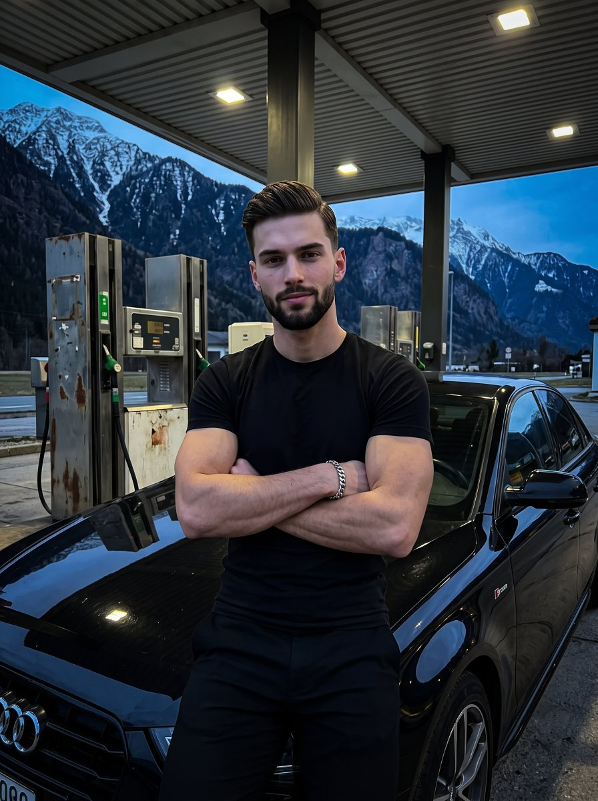

**Prompt**

```text
Um jovem adulto confiante e musculoso está enquadrado centralmente, olhando diretamente para o espectador com um sorriso sutil de lábios fechados e sobrancelhas relaxadas, com seu cabelo ondulado texturizado em estilo cortina capturando destaques especulares brilhantes. Ele está vestido com uma camiseta preta justa e calças pretas, posando deliberadamente de braços cruzados sobre o peito para acentuar sua musculatura; sua mão esquerda repousa naturalmente sobre o bíceps direito com os dedos levemente curvados, exibindo uma pulseira de corrente de prata grossa e totalmente visível. Ele se apoia de frente para a câmera contra o acabamento preto brilhante e impecável de um sedã Audi em primeiro plano, com o emblema S-line visível no para-lama dianteiro. À direita, no plano médio, bombas de gasolina desgastadas com carcaças brancas e amarelas e bicos verdes e pretos repousam sobre um piso de concreto cinza-escuro sólido. Acima dele, a cobertura industrial desgastada apresenta painéis metálicos bege-claro fosco com nervuras horizontais e luminárias quadradas embutidas brilhantes. Erguendo-se no fundo profundo, picos rochosos imponentes, íngremes e irregulares com manchas de neve branca desenham suas silhuetas em profundidade espacial. A cena é envolvida por uma atmosfera melancólica e de alto contraste sob um céu de crepúsculo azul-escuro, dominada por uma paleta complementar dividida e fria de pretos profundos e azuis crepusculares cortados por detalhes em branco-amarelado quente. A iluminação prática superior, dura e altamente direcional da cobertura mistura-se com o crepúsculo ambiente, projetando sombras pretas profundas, duras e definidas sob o queixo, sob os braços e sob o carro, enquanto reflete destaques especulares nas maçãs do rosto, na ponte do nariz e no capô do carro. Capturado como uma fotografia digital realista com uma lente de 35mm em f/2.8, ISO 800 e 1/125s, este retrato extremamente nítido combina a estética automotiva cinematográfica com influências contemporâneas de estilo de vida das redes sociais, aprimorado por sombras frias, leve clareamento suave (dodging) no rosto e realces elevados nos reflexos do carro, tudo lindamente enquadrado em uma proporção de 3:4.
```

[↑ Voltar às categorias](#catalog)

---

<a name="prompt-2097478436105384108"></a>

### Um prompt de foto de referência para stop-motion apresentando uma flor de cosmos rosa-coral feita à mão em argila fosca em solo marrom-escuro contra um fundo creme quente, especificando coordenadas precisas, ângulo de câmera e detalhes de textura da argila.

Autor：[@higgsfield](https://x.com/higgsfield) · [Publicação original](https://x.com/higgsfield/status/2097478436105384108)

Fotografia · Publicado

**Resumo:** Um prompt de foto de referência para stop-motion apresentando uma flor de cosmos rosa-coral feita à mão em argila fosca em solo marrom-escuro contra um fundo creme quente, especificando coordenadas precisas, ângulo de câmera e detalhes de textura da argila.


**Prompt**

```text
Crie uma única foto de referência quadrada de stop-motion, não um storyboard: uma flor de cosmos rosa-coral feita à mão em argila fosca em solo marrom-escuro contra um fundo creme quente. Câmera baixa frontal travada, macro de 70 mm, sensação ortográfica. O solo preenche os 22% inferiores, atingindo o pico em (50%,79%); o caule centralizado vai de (50%,80%) até o centro da flor em (50%,33%). Adicione exatamente duas folhas verdes e uma cabeça de flor com 35% de largura, exatamente 10 pétalas de cor coral e um centro dourado texturizado. Inclua impressões digitais sutis, pedaços de terra e algumas pedrinhas. Use iluminação suave do canto superior esquerdo e sombras fixas. Mantenha a flor completa visível, com a câmera e o solo estacionários para animação. Sem vaso, plantas extras, personagens, insetos, mãos, texto, marca d'água, borda ou grade.
```

[↑ Voltar às categorias](#catalog)

---

<a name="prompt-2097238007426490758"></a>

### Uma fotografia com flash de estilo de vida sofisticado de um homem estiloso e bronzeado em uma camisa preta desabotoada e óculos de sol ao lado de uma piscina de borda infinita durante o crepúsculo costeiro.

Autor：[@pictsbyai](https://x.com/pictsbyai) · [Publicação original](https://x.com/pictsbyai/status/2097238007426490758)

Fotografia · Retrato / Selfie · Personagem · Publicado

**Resumo:** Uma fotografia com flash de estilo de vida sofisticado de um homem estiloso e bronzeado em uma camisa preta desabotoada e óculos de sol ao lado de uma piscina de borda infinita durante o crepúsculo costeiro.


**Prompt**

```text
Um jovem atraente com pele bronzeada e brilhante está de frente para a câmera em uma postura confiante e formal, com os ombros relaxados para trás abrindo o peito. Ele veste uma camisa preta de manga longa desabotoada, um colar de corrente prateada e óculos de sol pretos estilo wayfarer que ocultam completamente seus olhos, combinando perfeitamente com sua expressão séria e neutra. Seu cabelo castanho de comprimento médio é estilizado em um penteado penteado para trás que alcança a nuca e fica discretamente atrás das orelhas, com volume moderado no topete frontal e assentado nas laterais. O cabelo exibe raízes loiro-escuras e castanhas em transição para pontas loiras mais claras, fixado firmemente por uma pomada pesada de efeito molhado que cria uma aparência brilhante e estruturada, com leve separação de mechas, irregularidade natural na linha do cabelo e pequenos fios soltos visíveis no lado direito da cabeça. Na parte inferior do tronco, suas mãos estão suavemente entrelaçadas de maneira relaxada; sua mão esquerda repousa por baixo com os dedos naturalmente curvados para dentro, enquanto a mão direita segura levemente os nós dos dedos esquerdos, exibindo anéis de prata e uma pulseira de corrente prateada. Ele está em um deck feito de tábuas de madeira desgastadas em tons quentes de cinza e marrom dispostas na diagonal, tendo ao fundo, em plano intermediário, uma piscina de borda infinita com águas escuras e cristalinas que refletem o vibrante céu crepuscular e suas roupas escuras. À direita do plano intermediário, uma balaustrada clássica de pedra com colunas arquitetônicas se destaca em silhueta contra a água, enquanto no primeiro plano superior o galho de um pinheiro paira suavemente sobre o enquadramento, com suas agulhas escuras captando bordas tênues do flash. O plano de fundo profundo estende-se em uma ampla paisagem costeira com colinas escuras em silhueta erguendo-se contra um céu crepuscular atmosférico, onde luzes dispersas de edifícios costeiros brilham suavemente na margem distante à esquerda. A cena é iluminada por uma iluminação mista, definida por um flash direto e potente sobre a câmera que projeta uma luz dourada e quente altamente direcional sobre o sujeito, criando realces especulares brilhantes em sua testa, dorso do nariz, maçãs do rosto, peito, mãos e joias metálicas. Esse flash intenso produz sombras pretas profundas, curtas e fechadas sob o queixo, dentro das dobras da camisa e sob as mãos unidas, contrastando dramaticamente com o crepúsculo ambiente sombrio e em low-key do fundo, que faz uma transição suave do calor do pôr do sol magenta-púrpura para um céu noturno azul-marinho profundo. A paleta de cores complementar dividida de tons quentes de flash contra azuis e roxos atmosféricos frios e dessaturados evoca uma atmosfera misteriosa e exclusiva de resort de luxo. Capturada com o estilo de fotografia digital realista de imagens de estilo de vida de paparazzi de alto padrão, a tomada é feita de frente, no nível dos olhos, usando uma lente equivalente a 35mm a 50mm, empregando um obturador arrastado em torno de 1/60s para equilibrar o sujeito perfeitamente nítido contra o fundo de baixa luminosidade ligeiramente mais suave e com ruído digital. O pós-processamento enfatiza pretos ligeiramente esmagados para alto contraste e destaca nitidez e clareza no rosto e nas joias do sujeito, com toda a impressionante composição enquadrada em um formato de retrato vertical 3:4.
```

[↑ Voltar às categorias](#catalog)

---

<a name="category-cinematic-film-still"></a>

## Cinematográfico / Imagem de Filme

<a name="prompt-2097564694974541836"></a>

### Crie um retrato editorial de streetwear cinematográfico e ultrarrealista em um ambiente urbano.

Autor：[@shushant\_l](https://x.com/shushant_l) · [Publicação original](https://x.com/shushant_l/status/2097564694974541836)

Cinematográfico / Imagem de Filme · Retrato / Selfie · Paisagem Urbana / Rua · Publicado

**Resumo:** Crie um retrato editorial de streetwear cinematográfico e ultrarrealista em um ambiente urbano.

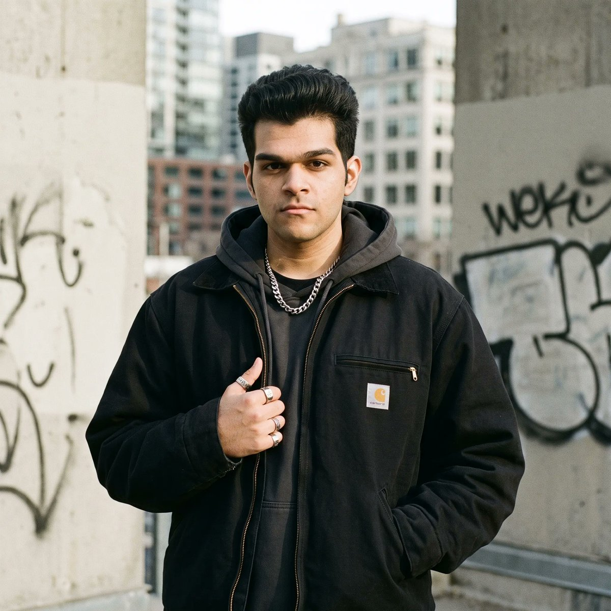

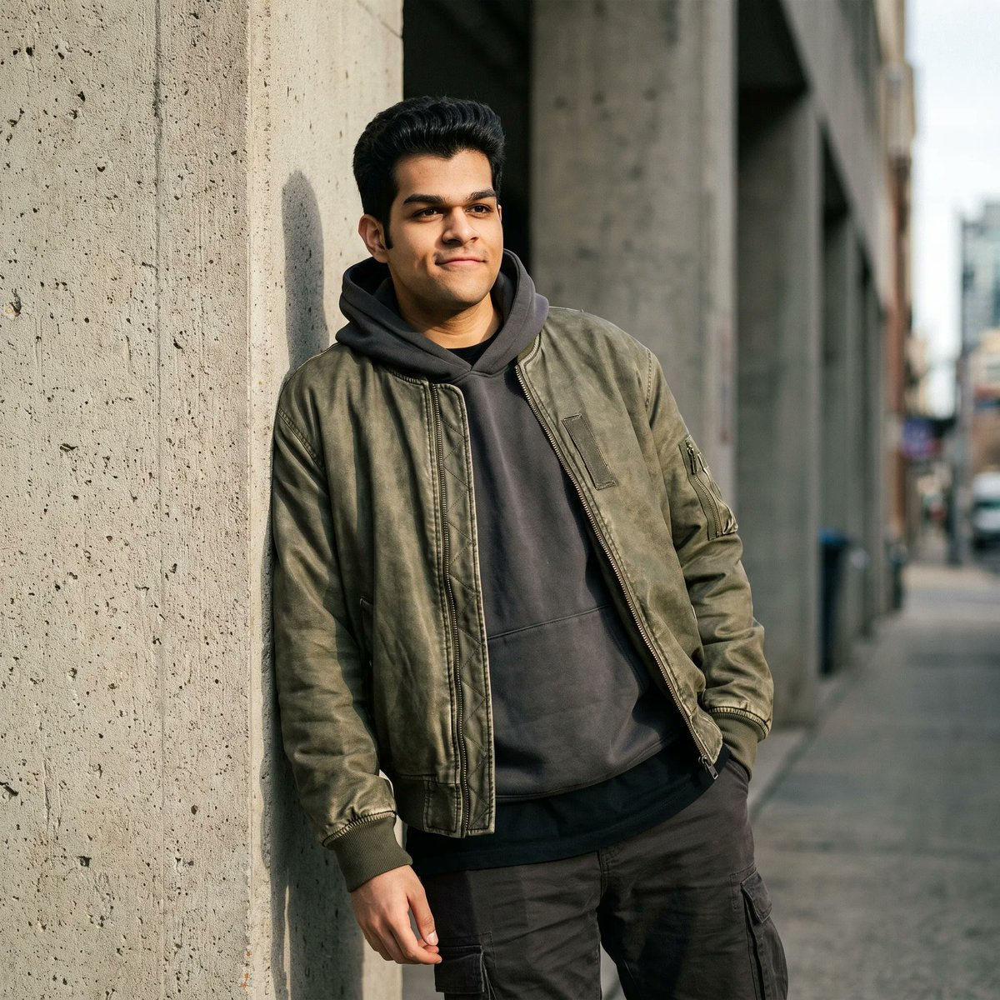

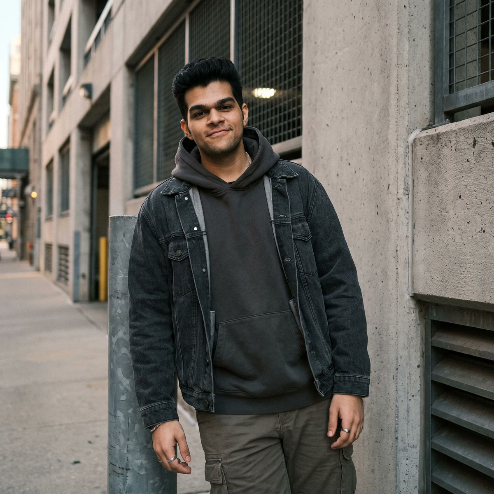

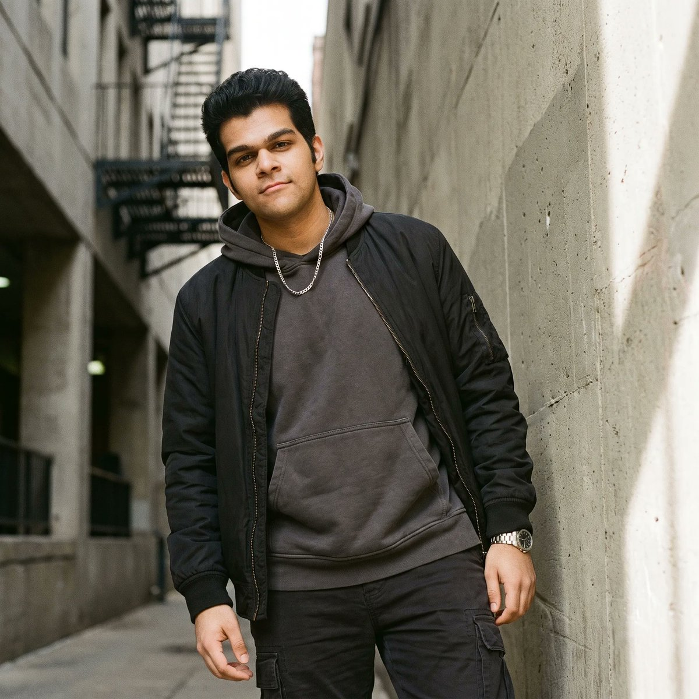

**Prompt**

```text
Crie um retrato editorial de streetwear cinematográfico e ultrarrealista de mim, preservando exatamente minha identidade facial, traços, tom de pele, penteado e proporções naturais. Vista-me com streetwear moderno de alta qualidade com um look em camadas oversized, acessórios sutis e uma pose confiante e relaxada em um cenário urbano com arquitetura de concreto, paredes texturizadas e detalhes urbanos discretos. Use iluminação natural dramática, sombras suaves, profundidade de campo rasa, textura de pele realista, tons neutros sofisticados, granulação de filme sutil, composição de revista de alta moda, fotografia profissional e gradação de cores cinematográfica. Faça a imagem parecer autêntica, descontraída e estilosa, minimalista, estética e editorial, como uma campanha de streetwear de luxo fotografada em uma câmera full-frame com lente de 85 mm.
```

[↑ Voltar às categorias](#catalog)

---

<a name="prompt-2097549831489405424"></a>

### Prompt de pôster de viagem alpina cinematográfico 9:16 com lago de montanha, viajante no píer e tipografia de revista.

Autor：[@aniyaintel](https://x.com/aniyaintel) · [Publicação original](https://x.com/aniyaintel/status/2097549831489405424)

Pôster / Flyer · Cinematográfico / Imagem de Filme · Paisagem / Natureza · Texto / Tipografia · Publicado

**Resumo:** Prompt de pôster de viagem alpina cinematográfico 9:16 com lago de montanha, viajante no píer e tipografia de revista.

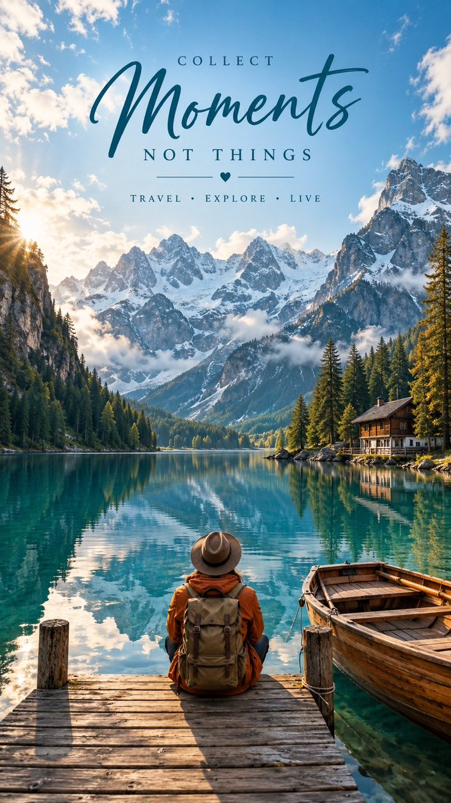

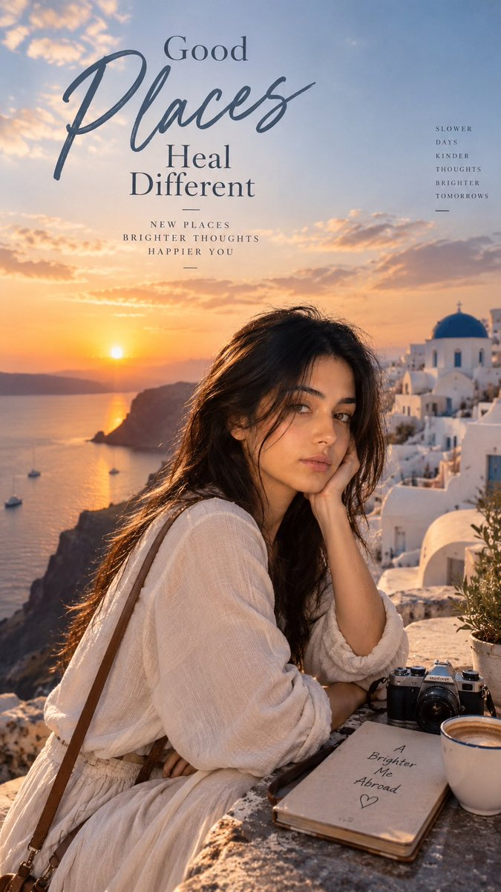

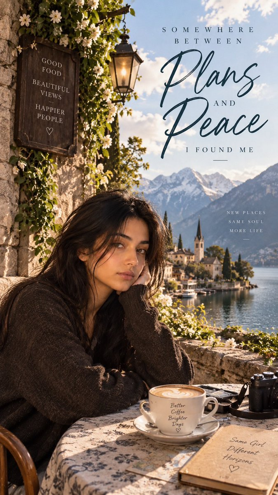

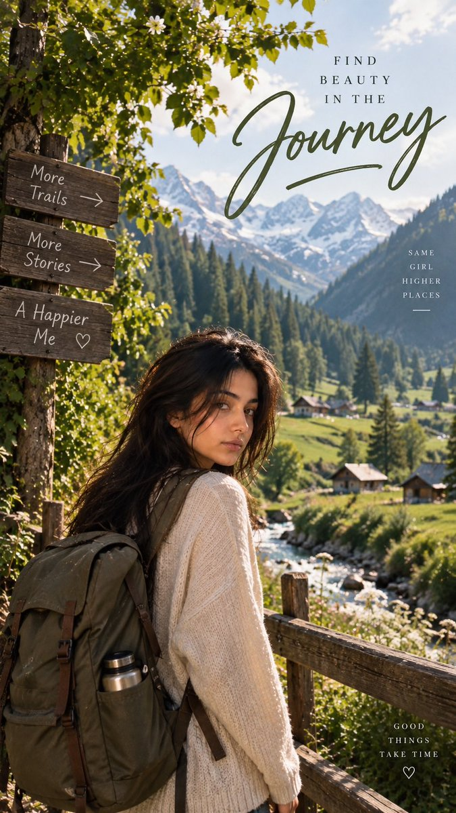

**Prompt**

```text
Crie um pôster editorial de viagem cinematográfico, hiper-realista e de alta qualidade no formato vertical 9:16.

Cena: Um lago alpino deslumbrante nas montanhas com águas azul-turquesa cristalinas, cercado por dramáticas montanhas cobertas de neve, densas florestas de pinheiros perenes e penhascos rochosos íngremes. O lago reflete perfeitamente as montanhas e o céu. Uma pequena cabana rústica de madeira fica perto da margem direita, enquanto um barco a remo tradicional de madeira está amarrado ao lado de um píer de madeira em primeiro plano.

No centro do primeiro plano, mostre um viajante solitário sentado no píer de madeira de costas para a câmera, olhando pacificamente para as montanhas. O viajante usa um chapéu de aba larga marrom, jaqueta outdoor laranja-queimado, mochila de trilha bege/marrom e roupas outdoor neutras. Proporções naturais e realistas e textura de roupa sutil.

Composição: Fotografia cinematográfica em grande-angular, viajante posicionado no centro inferior, barco no canto inferior direito, lago amplo e montanhas dominando o fundo. Forte profundidade, perspectiva natural, paisagem em camadas, atmosfera pacífica e aventureira.

Iluminação: Luz suave da manhã dourada, céu azul brilhante com nuvens fofas dispersas, névoa atmosférica sutil ao redor das montanhas, luz solar realista e sombras naturais. Cores ricas mas autênticas, água turquesa, primeiro plano em tons terrosos de marrom, floresta verde exuberante, montanhas em azul frio.

Tipografia: Adicione uma tipografia elegante de pôster de viagem sobre a parte superior da imagem:

Texto pequeno em maiúsculas: “COLLECT”
Texto manuscrito/cursivo grande e estiloso: “Moments”
Texto médio em maiúsculas abaixo: “NOT THINGS”
Linhas horizontais decorativas mínimas com um pequeno símbolo de coração
Slogan pequeno em maiúsculas: “TRAVEL • EXPLORE • LIVE”

Use tipografia sofisticada em verde-azulado escuro (dark teal), espaçamento limpo, design editorial premium, hierarquia equilibrada, texto altamente legível e decoração mínima de bom gosto.

Estilo: Revista de viagens de luxo, fotografia cinematográfica, ultradetalhado, fotorrealista, fotografia profissional de DSLR, HDR, reflexos de água realistas, texturas naturais de pele/roupas, gradação de cores sutilmente fílmica, profundidade atmosférica, estética de viagens premium do Pinterest, clima inspirador e pacífico.

Evite: pessoas distorcidas, membros extras, arquitetura irrealista, saturação excessiva, detalhes borrados, aparência de desenho animado, água com aspecto falso, tipografia desordenada, logotipos, marcas d'água.
```

[↑ Voltar às categorias](#catalog)

---

<a name="prompt-2097524090735075539"></a>

### Um prompt de retrato de moda cinematográfico de alto padrão retratando uma mulher elegante entre papoulas vermelhas vívidas e gigantescas sob a iluminação quente da hora de ouro.

Autor：[@codewithhajra](https://x.com/codewithhajra) · [Publicação original](https://x.com/codewithhajra/status/2097524090735075539)

Fotografia · Cinematográfico / Imagem de Filme · Retrato / Selfie · Personagem · Item de Moda · Publicado

**Resumo:** Um prompt de retrato de moda cinematográfico de alto padrão retratando uma mulher elegante entre papoulas vermelhas vívidas e gigantescas sob a iluminação quente da hora de ouro.


**Prompt**

```text
Um deslumbrante retrato de moda cinematográfico ultrafotorrealista de uma mulher adulta elegante cercada por enormes papoulas vermelhas vívidas, capturado em um cenário editorial de jardim onírico. Ela tem pele clara e luminosa com textura natural realista, bochechas suavemente coradas, traços faciais simétricos e refinados, olhos expressivos azul-acinzentados claros, sobrancelhas delicadas, cílios definidos, um nariz reto gracioso e lábios carnudos naturais e brilhantes em tom nude-rosado. Sua expressão é calma, serena e sutilmente cativante, olhando diretamente para a câmera.
Seu longo cabelo loiro-dourado é dividido perfeitamente ao meio e puxado suavemente para trás, com fios individuais finos captando a luz do sol. Papoulas gigantescas em vermelho-escarlate emolduram o lado esquerdo de seu rosto e sobrepõem parcialmente seu cabelo, enquanto flores vermelhas gigantescas adicionais preenchem o primeiro plano e o fundo, criando uma dramática composição floral.
Ela veste um requintado vestido de alta-costura em tom rosa-claro suave, feito de chiffon/tule plissado leve. O vestido apresenta uma gola alta e franzida exagerada de inspiração vitoriana ao redor do pescoço, plissados verticais intrincados, ombros esculturais volumosos e camadas esvoaçantes de tecido translúcido caindo em cascata lindamente pela parte inferior do enquadramento. O tecido delicado capta a luz solar e cria realces suaves, sombras, dobras e uma transparência sutil.
A luz dourada e quente do entardecer ilumina seu rosto lateralmente, produzindo uma atmosfera brilhante em pêssego-rosado, realces luminosos na pele, sombras faciais suaves e reflexos vermelhos ricos vindos das flores. Atrás dela, há um céu azul-pastel límpido com um horizonte suavemente desfocado e campos infinitos de flores vermelhas.
Composição: retrato de moda em primeiro plano a plano médio, rosto centralizado, enquadramento vertical 4:5, flores emoldurando dramaticamente o sujeito, profundidade de campo rasa, pétalas em primeiro plano suavemente desfocadas para criar profundidade, separação cinematográfica entre o sujeito e o fundo.
Estilo: editorial de moda de luxo de alta costura, fotografia artística romântica e onírica, fotorrealista, gradação de cores sofisticada, textura natural da pele, física de tecido realista, detalhes intrincados nas flores, profundidade atmosférica suave, iluminação cinematográfica, granulação sutil de filme, HDR, detalhes em 8K, lente de retrato de 85mm, f/1.8, fotografia profissional com qualidade de estúdio.
Prompt negativo: desenho animado, anime, ilustração, pele plástica, maquiagem excessiva, rosto distorcido, olhos assimétricos, mãos malformadas, dedos extras, flores duplicadas, cabelo não natural, cores supersaturadas, rosto borrado, baixa resolução, sombras duras, pele artificial, texto, marca d'água, logotipo.
```

[↑ Voltar às categorias](#catalog)

---

<a name="prompt-2097237465887338994"></a>

### TÍTULO: Storyboard para Comercial de Bebida de Limão Gaseificada Premium FORMATO: • Storyboard premium em página única • Proporção retrato 3:4 • Campanha de bebida de luxo • 8 cenas cinematográficas focadas no produto • O produto permanece como o protagonista visual • Apresentação comercial de alto padrão

Autor：[@Strength04\_X](https://x.com/Strength04_X) · [Publicação original](https://x.com/Strength04_X/status/2097237465887338994)

Quadrinhos / Storyboard · Marketing de Produto · Cinematográfico / Imagem de Filme · Retrato / Selfie · Produto · Alimentos / Bebidas · Publicado

**Resumo:** TÍTULO: Storyboard para Comercial de Bebida de Limão Gaseificada Premium FORMATO: • Storyboard premium em página única • Proporção retrato 3:4 • Campanha de bebida de luxo • 8 cenas cinematográficas focadas no produto • O produto permanece como o protagonista visual • Apresentação comercial de alto padrão


**Prompt**

```text
TÍTULO:
Storyboard para Comercial de Bebida de Limão Gaseificada Premium

FORMATO:
• Storyboard premium em página única
• Proporção retrato 3:4
• Campanha de bebida de luxo
• 8 cenas cinematográficas focadas no produto
• O produto permanece como o protagonista visual
• Apresentação comercial de alto padrão

CABEÇALHO:
• Tipografia contemporânea em negrito
• Cartões informativos:
  - Duração: 20 Segundos
  - Estilo: Comercial Cinematográfico de Bebidas em Alta Velocidade
  - Produto: Bebida de Limão Gaseificada
  - Áudio: Efervescência + Estalo de Gelo + ASMR Líquido
• Seção "Por que este estilo funciona"
• Estética em branco cristal, amarelo-limão e prata
• Acentos gráficos minimalistas inspirados em frutas cítricas

STORYBOARD:
1. Garrafa gelada isolada com forte condensação
2. Macro extrema de gotículas de água deslizando pela garrafa
3. Tampa da garrafa abrindo com uma dramática explosão de carbonatação
4. Bebida com gás explodindo para cima em um respingo líquido controlado
5. Fatias de limão girando através do líquido espumante
6. Cubos de gelo caindo em um copo de cristal em câmera ultralenta
7. Macro extrema mostrando milhares de bolhas de carbonatação subindo pela bebida
8. Packshot hero final com garrafa, copo, fatias de limão e respingo congelado ao redor do produto

CADA PAINEL:
• Número da cena
• Selo de duração
• Direção de câmera
• Visual
• Ação
• Detalhe do produto

CÂMERA:
Fotografia líquida de alta velocidade a 120 fps, macro extrema, respingo congelado, fatias de limão giratórias, contraluz dramática, close-up da condensação, movimento suave de 360° do produto.

ESTILO:
Comercial de bebida premium ultrarrealista, líquido cristalino, carbonatação explosiva, gotículas de água fisicamente precisas
```

[↑ Voltar às categorias](#catalog)

---

<a name="category-3d-render"></a>

## Renderização 3D

<a name="prompt-2097629839209758892"></a>

### Tradução em andamento

Autor：[@Gdgtify](https://x.com/Gdgtify) · [Publicação original](https://x.com/Gdgtify/status/2097629839209758892)

Renderização 3D · Publicado

**Resumo:** Tradução em andamento

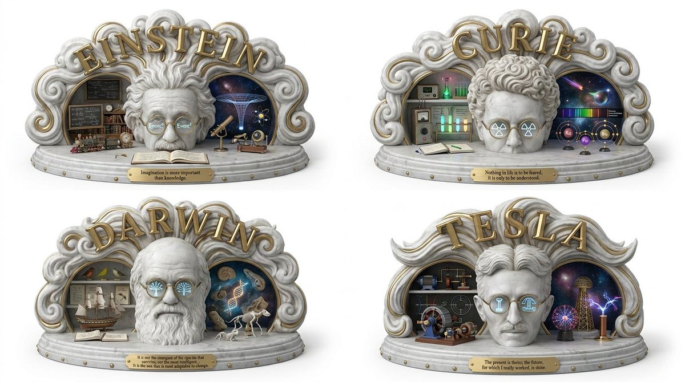

**Prompt**

```text
Tradução em andamento
```

[↑ Voltar às categorias](#catalog)

---

<a name="category-cyberpunk-sci-fi"></a>

## Cyberpunk / Ficção Científica

<a name="prompt-2097435473043931201"></a>

### Prompts retratando cidades iluminadas flutuantes suspensas sobre mares de nuvens sob gigantescas nebulosas em anel cósmico brilhantes.

Autor：[@churvikv](https://x.com/churvikv) · [Publicação original](https://x.com/churvikv/status/2097435473043931201)

Cyberpunk / Ficção Científica · Publicado

**Resumo:** Prompts retratando cidades iluminadas flutuantes suspensas sobre mares de nuvens sob gigantescas nebulosas em anel cósmico brilhantes.


**Prompt**

```text
Prompt 1:
Uma encantadora ilustração digital de uma paisagem urbana suspensa sobre um mar de nuvens noturnas e fofas sob um céu mágico. Em primeiro plano, um denso aglomerado de arranha-céus imponentes, com suas janelas iluminadas por luzes douradas e quentes, cria uma linha do horizonte urbana brilhante. A cidade parece repousar sobre um manto espesso e ondulante de nuvens azuis-escuras e cinzentas que se estendem pela distância. Acima da cidade, o céu noturno se transforma em uma maravilha celestial: um anel enorme e luminoso de uma nebulosa colorida envolve um vazio escuro e repleto de estrelas. A nebulosa brilha com tons vibrantes de roxo profundo, azul elétrico e laranja ardente, salpicada de estrelas cintilantes e constelações distantes, criando uma atmosfera onírica e de outro mundo.

Prompt 2:
Uma vista vertical deslumbrante de uma metrópole futurista flutuando graciosamente sobre um mar sem fim de nuvens cinza-escuras, densas e ondulantes ao crepúsculo. A vasta linha do horizonte da cidade apresenta numerosos arranha-céus imponentes com janelas brilhantes que projetam luzes quentes em tons de âmbar e laranja sobre a paisagem urbana abaixo. Dominando a parte superior do enquadramento está um magnífico anel cósmico, uma nebulosa circular brilhante composta de roxos vibrantes, azuis profundos e tons dourados quentes e radiantes, salpicada de inúmeras estrelas cintilantes e galáxias distantes pelo céu noturno profundamente negro. A composição é equilibrada e majestosa, com a camada escura de nuvens ancorando o primeiro plano inferior, contrastando fortemente com o radiante fenômeno cósmico acima. A iluminação é surreal e etérea, misturando o brilho artificial quente das luzes da cidade com a luminescência cósmica da nebulosa. A atmosfera é silenciosa, inspiradora e mística, evocando uma sensação de maravilha interestelar e isolamento urbano. As texturas detalhadas das nuvens suaves e volumosas, a arquitetura elegante de vidro e aço dos arranha-céus e a poeira cósmica estrelada criam uma cena de alto contraste e visualmente impressionante.
```

[↑ Voltar às categorias](#catalog)

---

<a name="category-other"></a>

## Outros

<a name="prompt-2097547198523388128"></a>

### Tradução em andamento

Autor：[@AIGuideNote](https://x.com/AIGuideNote) · [Publicação original](https://x.com/AIGuideNote/status/2097547198523388128)

Marketing de Produto · Pôster / Flyer · Publicado

**Resumo:** Tradução em andamento

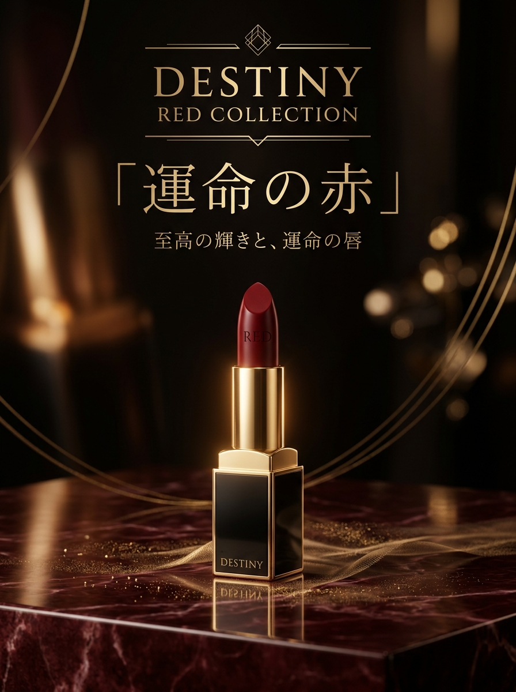

**Prompt**

```text
Tradução em andamento
```

[↑ Voltar às categorias](#catalog)

---

<a name="prompt-2097548956251168916"></a>

### Retrato de estúdio de alta-costura de uma mulher elegante em um vestido preto em uma cadeira escultural preta.

Autor：[@Elvorya](https://x.com/Elvorya) · [Publicação original](https://x.com/Elvorya/status/2097548956251168916)

Retrato / Selfie · Personagem · Item de Moda · Publicado

**Resumo:** Retrato de estúdio de alta-costura de uma mulher elegante em um vestido preto em uma cadeira escultural preta.


**Prompt**

```text
Retrato de estúdio de alta-costura ultrarrealista de uma mulher elegante sentada graciosamente contra um fundo cinza-chumbo escuro. Ela veste um sofisticado vestido de cetim preto de um ombro só com enfeites brilhantes sutis. Cabelos castanho-escuros lisos e alinhados, penteados para trás das costas com perfeição. Maquiagem glamourosa e refinada, sobrancelhas suavemente definidas, sombra marrom esfumada, delineador marcado, cílios longos, blush quente, pele natural radiante e lábios rosa nude brilhantes. Ela usa elegantes brincos pendentes geométricos de prata, vários anéis de prata delicados, uma pulseira fina e um pequeno ear cuff.

Pose: sentada em uma cadeira escultural preta brilhante, um braço apoiado naturalmente sobre a cadeira e a outra mão levantada delicadamente sob o queixo, com dedos relaxados e elegantes. Unhas compridas e bem cuidadas com esmalte preto brilhante. Olhar direto, calmo e confiante para a câmera, expressão sofisticada.

Fotografia profissional de beleza de luxo, iluminação principal suave e difusa, luz de recorte sutil, sombras profundas, alto contraste, textura de pele realista, traços faciais detalhados, acabamento editorial impecável, atmosfera cinematográfica, foco nítido, lente de retrato de 85 mm, profundidade de campo rasa, estética de revista de moda de alto padrão, fotorrealista, 4K, composição vertical.
```

[↑ Voltar às categorias](#catalog)

---

<a name="prompt-2097482618992570627"></a>

### Prompt poético de um dragão cósmico com asas antigas e holográficas pairando sobre uma cidade moderna de néon.

Autor：[@ToshiArte](https://x.com/ToshiArte) · [Publicação original](https://x.com/ToshiArte/status/2097482618992570627)

Animal / Criatura · Publicado

**Resumo:** Prompt poético de um dragão cósmico com asas antigas e holográficas pairando sobre uma cidade moderna de néon.


**Prompt**

```text
Onde a Asa Lembra Ambas as Margens

O dragão não escolhe um século.
É o século escolhendo a si mesmo
através de um corpo feito de adiamento e resplendor crepuscular.
Uma asa rasteja a última página não queimada de uma biblioteca
que caiu antes de o papel aprender seu próprio nome.
A outra penteia a chuva holográfica
de torres que ainda não decidiram
se permanecerão de pé ou se tornarão um boato.
Entre elas, o ar guarda dois calendários
e esquece qual deles está correndo.
Suas escamas são mais antigas do que a palavra para escama.
Elas lembram o calor de forjas
que ainda não foram acesas,
e o frio de estrelas
que já se apagaram
em alguma outra narrativa.
Runas emergem e afundam como pensamentos
que uma cidade não conquistou o direito de pensar.
Cada pulso de luz é tanto relíquia quanto protótipo.
Abaixo, as ruas estão molhadas com o que aconteceu
e com o que ainda está negociando sua chegada.
O néon escreve sobre a água que já foi a paciência de uma geleira
e será, mais tarde, apenas um rumor de sede.
Fundações repousam sobre o silêncio de florestas
que ainda sonham que estão de pé.
Outdoors anunciam amanhãs
já nostálgicos pelo crepúsculo que ainda não chegou.
Os olhos da criatura guardam o único clima honesto:
um o verde de uma memória
que ainda não sabe que terminou,
o outro o azul de uma pergunta
que não encontrou a boca que irá fazê-la.
Eles olham para nós do jeito que o tempo olha para si mesmo
quando ninguém está vigiando
sem piedade, sem veredito,
apenas a longa cortesia da atenção.
Vivemos na breve corrente descendente de sua passagem,
aquele intervalo estranho e misericordioso
onde o passado ainda não terminou conosco
e o futuro já começou
a sentir falta daquilo que ainda não perdemos.
Nada é prometido exceto a virada:
a dobradiça lenta e luminosa de uma asa
que pertence a todas as horas de uma vez
e a nenhuma delas por completo.
A névoa que ele deixa não é fim nem começo.
É o lugar onde eles brevemente se reconhecem
antes que a próxima incerteza
abra sua mão silenciosa e necessária.
```

[↑ Voltar às categorias](#catalog)

---

[Explore a Leadde.ai →](https://leadde.ai/?utm_source=github&utm_medium=readme&utm_campaign=prompt-library&utm_content=nano-banana)
