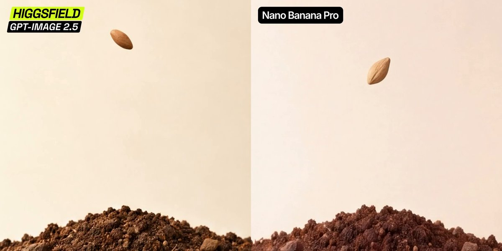
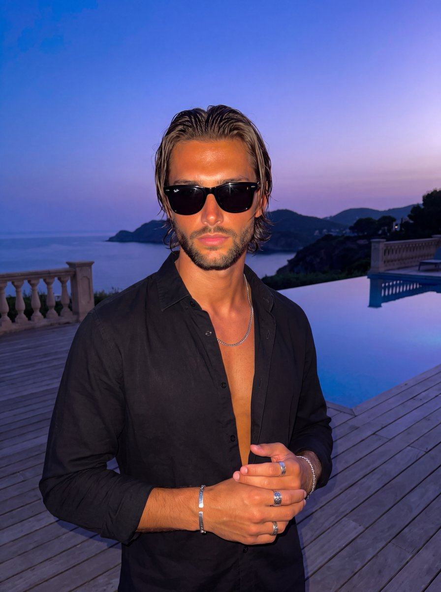
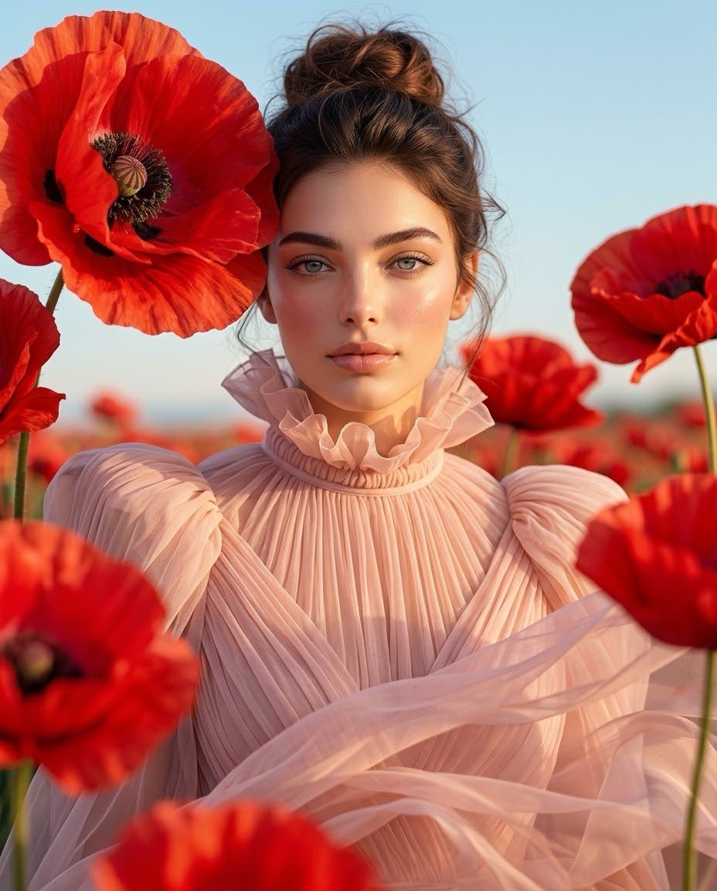
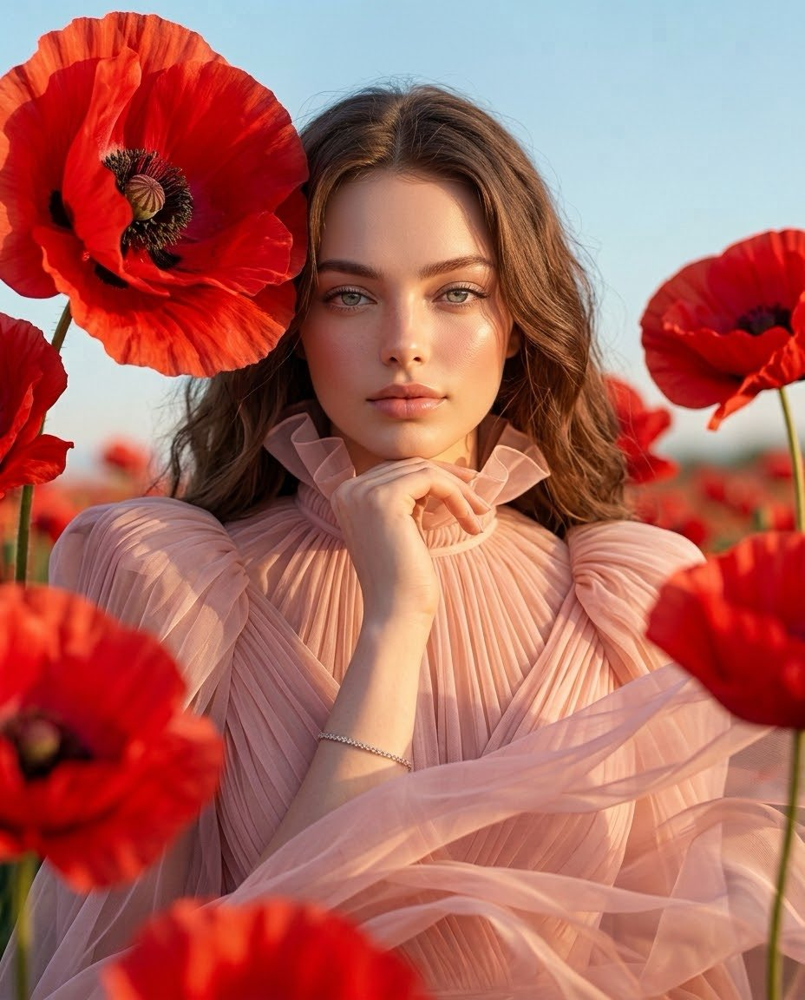
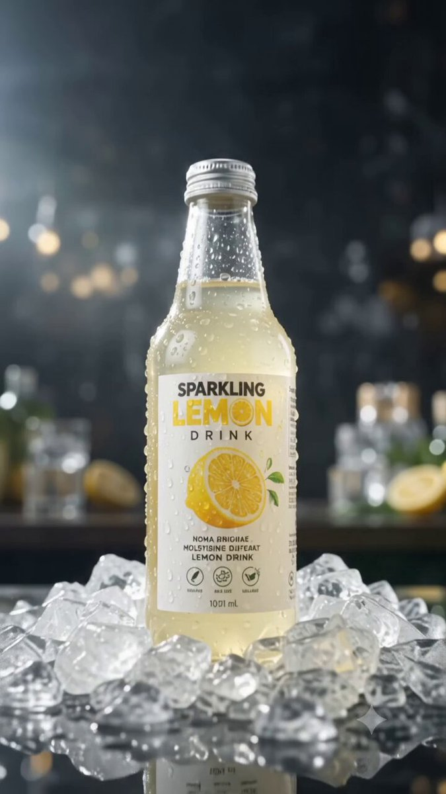
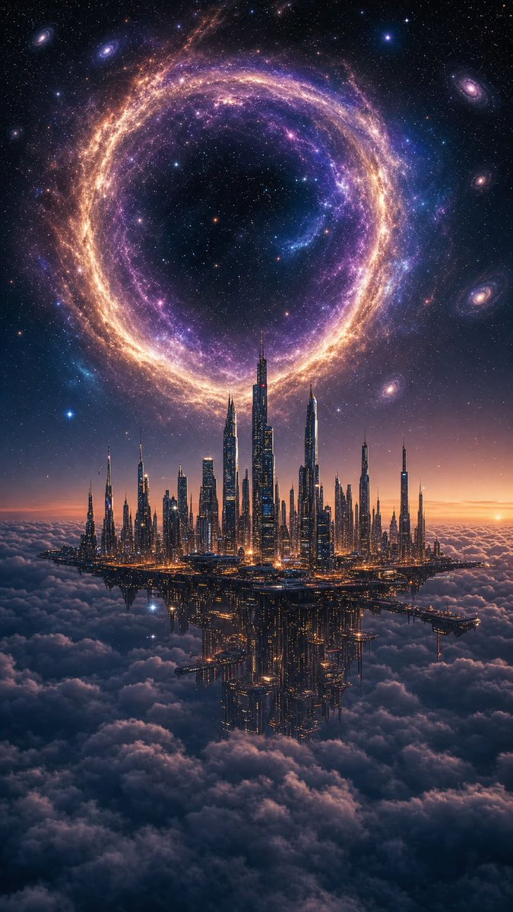
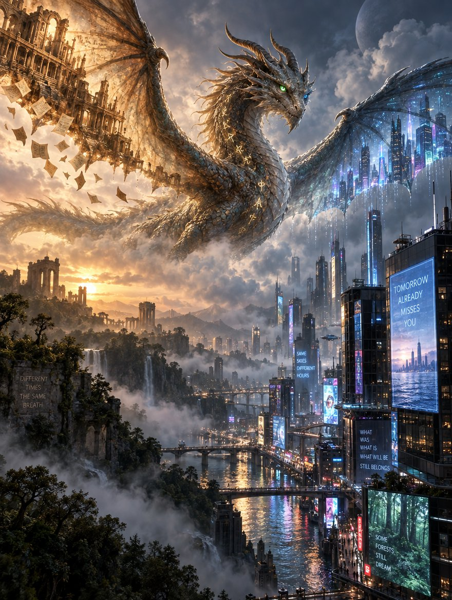
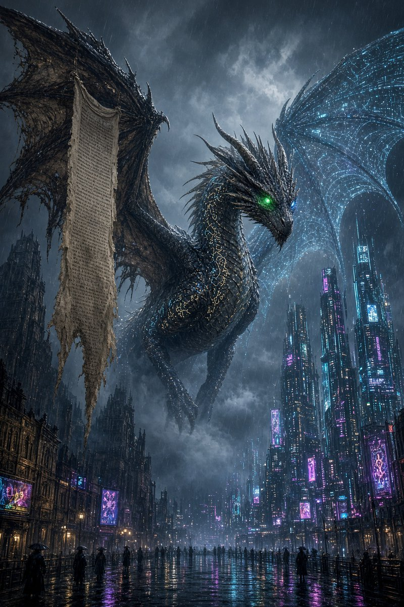
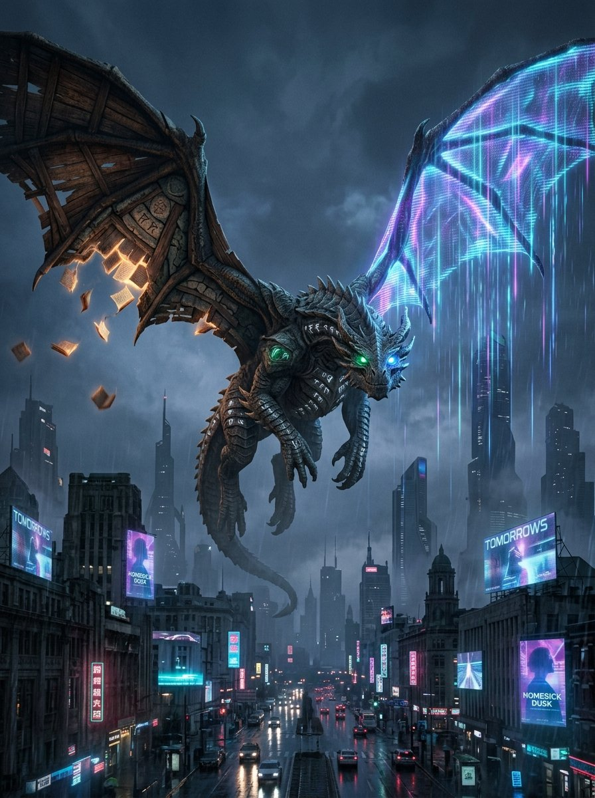
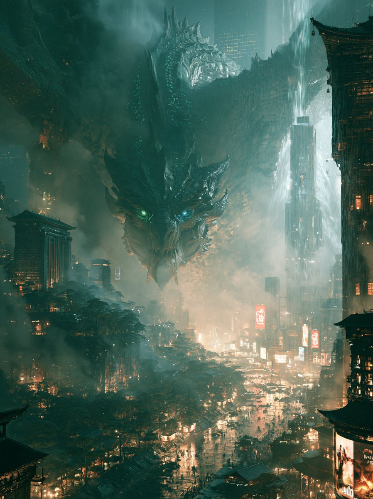

# Nano Banana · Prompt 資料庫 · Leadde.ai

[](README.md) [](README_zh.md) [](README_zh-TW.md) [](README_ja-JP.md) [](README_ko-KR.md) [](README_th-TH.md) [](README_vi-VN.md) [](README_hi-IN.md) [](README_es-ES.md) [-lightgrey)](README_es-419.md) [](README_de-DE.md) [](README_fr-FR.md) [](README_it-IT.md) [-lightgrey)](README_pt-BR.md) [](README_pt-PT.md) [](README_tr-TR.md)

> **每日更新，精選高品質提示詞**

探索用於 AI 圖像、影片與 3D 創作的完整提示詞。依風格瀏覽、切換多語言版本，查看原作者與作品來源。

[探索 Leadde.ai →](https://leadde.ai/?utm_source=github&utm_medium=readme&utm_campaign=prompt-library&utm_content=nano-banana)

## 認識 Leadde.ai

Leadde.ai 協助團隊將文件、簡報和文字轉換為 AI 商業影片，適用於培訓、員工入職與行銷。

為儲存庫加上 Star，追蹤每日精選提示詞，持續獲得創作靈感。

**7** 筆內容 · 最新收錄: **2026-09-09**

<a name="catalog"></a>

## 分類目錄

[攝影](#category-photography) · [電影感 / 電影劇照](#category-cinematic-film-still) · [賽博龐克 / 科幻](#category-cyberpunk-sci-fi) · [其他](#category-other)

<a name="all-prompts"></a>

<a name="category-photography"></a>

## 攝影

<a name="prompt-2097478436105384108"></a>

### 翻譯中

作者：[@higgsfield](https://x.com/higgsfield) · [查看 X 原帖](https://x.com/higgsfield/status/2097478436105384108)

攝影 · 已推流

**概括:** 翻譯中



**提示詞**

```text
翻譯中
```

[↑ 返回分類目錄](#catalog)

---

<a name="prompt-2097238007426490758"></a>

### 一張頂級生活風格閃光燈攝影照片，呈現一位膚色曬成健康小麥色、身穿敞開扣子黑襯衫並配戴墨鏡的時髦男子，在沿海暮色下的無邊際泳池旁凝立。

作者：[@pictsbyai](https://x.com/pictsbyai) · [查看 X 原帖](https://x.com/pictsbyai/status/2097238007426490758)

攝影 · 人像 / 自拍 · 角色 · 已推流

**概括:** 一張頂級生活風格閃光燈攝影照片，呈現一位膚色曬成健康小麥色、身穿敞開扣子黑襯衫並配戴墨鏡的時髦男子，在沿海暮色下的無邊際泳池旁凝立。



**提示詞**

```text
一位英俊的年輕男子，擁有健康發亮的小麥色肌膚，以自信、端莊的姿態正面迎向鏡頭，雙肩向後放鬆以舒展胸膛。他穿著一件敞開扣子的黑色長袖襯衫，配戴一條銀色項鍊以及完全遮蔽雙眼的黑色旅行者風格太陽眼鏡，與他嚴肅而中性的神情完美契合。他的棕色中長髮被打理成後梳流暢背頭髮型，長度垂及頸項並俐落地收在耳後，前額處的Quiff微具份量感，兩側則服貼平順。髮絲顯現出深金棕色髮根漸變至較淺金色的髮尾，並被厚重的濕髮感髮油牢牢固定，呈現出具光澤且結構分明的質感，髮束間帶有輕微的分離感，髮際線具有自然的參差，頭部右側亦可見些許細碎髮絲。在下腹部位置，他的雙手以放鬆的姿態輕柔交疊；左手襯在下方，手指自然向內彎曲，右手則輕輕握住左手關節，展現出銀色戒指與銀鍊手鐲。他佇立於斜向鋪設的褪色暖灰及棕色木棧板露台上，中景是一座無邊際泳池，清澈深邃的池水倒映著絢爛的暮色天空與他身上的暗色服裝。在中景右側，帶有建築立柱造型的經典石質欄杆在水面襯托下形成剪影，上方前景的一抹松樹枝輕垂入畫面，暗色松針隱約捕捉到閃光燈的邊緣光。深邃的遠景延伸至廣袤的海岸景致，暗色的山丘剪影在富含氛圍的薄暮天空中起伏，極左側海岸線點綴著隱約閃爍的沿海建築燈火。場景採用混合光源照明，其特色為硬質且直射的機頂閃光燈將高指向性的暖金光芒投射在主體身上，在他的額頭、鼻樑、顴骨、胸膛、雙手及金屬飾品上產生明亮的鏡面高光。這道強烈的閃光在他的下巴下方、襯衫皺褶處以及交握的雙手下方刻劃出深黑、短促且緊實的陰影，與背景陰鬱、低調的薄暮環境光形成強烈對比；背景從洋紅偏紫的落日餘溫平滑過渡至深邃暗沉的藏青夜空。暖色閃光調與冷色調、低飽和的大氣藍紫色構成的分裂互補色彩，烘托出神秘而奢華的度假勝地氛圍。照片以高端狗仔生活風格寫實數位攝影手法呈現，使用相當於35mm至50mm焦段的鏡頭於平視高度正面拍攝，搭配約1/60秒的慢速同步快門，在高銳利度的主體與略微柔和、帶有數位噪點的低光背景之間取得平衡。後製著重在微壓暗部以呈現高對比，並大幅提升主體臉部與首飾的銳利度與清晰度，整幅極具視覺張力的構圖以3:4直式人像比例呈現。
```

[↑ 返回分類目錄](#catalog)

---

<a name="category-cinematic-film-still"></a>

## 電影感 / 電影劇照

<a name="prompt-2097524090735075539"></a>

### 翻譯中

作者：[@codewithhajra](https://x.com/codewithhajra) · [查看 X 原帖](https://x.com/codewithhajra/status/2097524090735075539)

攝影 · 電影感 / 電影劇照 · 人像 / 自拍 · 角色 · 時尚單品 · 已推流

**概括:** 翻譯中





**提示詞**

```text
翻譯中
```

[↑ 返回分類目錄](#catalog)

---

<a name="prompt-2097237465887338994"></a>

### 翻譯中

作者：[@Strength04\_X](https://x.com/Strength04_X) · [查看 X 原帖](https://x.com/Strength04_X/status/2097237465887338994)

漫畫 / 分鏡腳本 · 產品行銷 · 電影感 / 電影劇照 · 人像 / 自拍 · 產品 · 食物 / 飲品 · 已推流

**概括:** 翻譯中



**提示詞**

```text
翻譯中
```

[↑ 返回分類目錄](#catalog)

---

<a name="category-cyberpunk-sci-fi"></a>

## 賽博龐克 / 科幻

<a name="prompt-2097435473043931201"></a>

### 翻譯中

作者：[@churvikv](https://x.com/churvikv) · [查看 X 原帖](https://x.com/churvikv/status/2097435473043931201)

賽博龐克 / 科幻 · 已推流

**概括:** 翻譯中




**提示詞**

```text
翻譯中
```

[↑ 返回分類目錄](#catalog)

---

<a name="category-other"></a>

## 其他

<a name="prompt-2097548956251168916"></a>

### 翻譯中

作者：[@Elvorya](https://x.com/Elvorya) · [查看 X 原帖](https://x.com/Elvorya/status/2097548956251168916)

人像 / 自拍 · 角色 · 時尚單品 · 已推流

**概括:** 翻譯中


**提示詞**

```text
翻譯中
```

[↑ 返回分類目錄](#catalog)

---

<a name="prompt-2097482618992570627"></a>

### 翻譯中

作者：[@ToshiArte](https://x.com/ToshiArte) · [查看 X 原帖](https://x.com/ToshiArte/status/2097482618992570627)

動物 / 生物 · 已推流

**概括:** 翻譯中









**提示詞**

```text
翻譯中
```

[↑ 返回分類目錄](#catalog)

---

[探索 Leadde.ai →](https://leadde.ai/?utm_source=github&utm_medium=readme&utm_campaign=prompt-library&utm_content=nano-banana)
