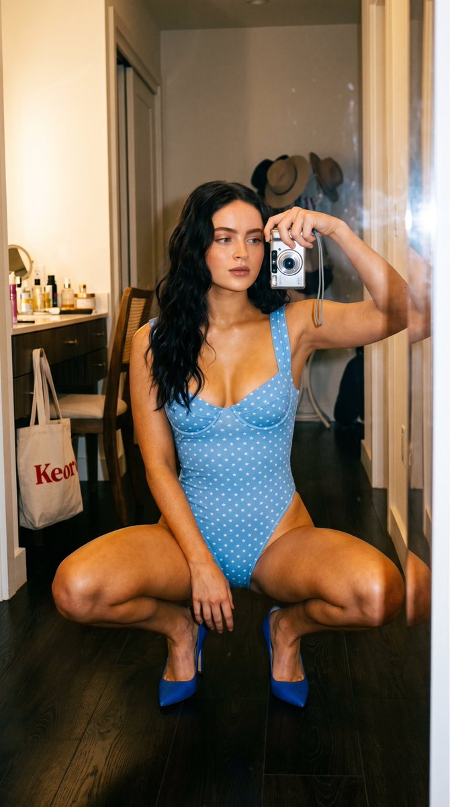
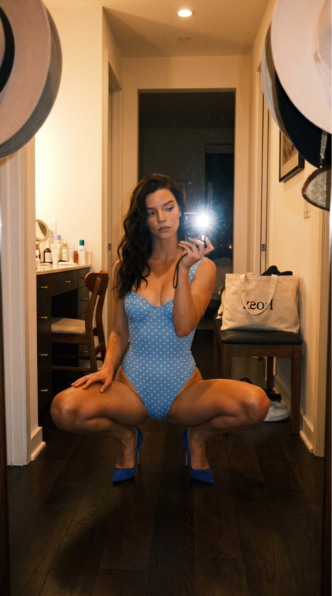
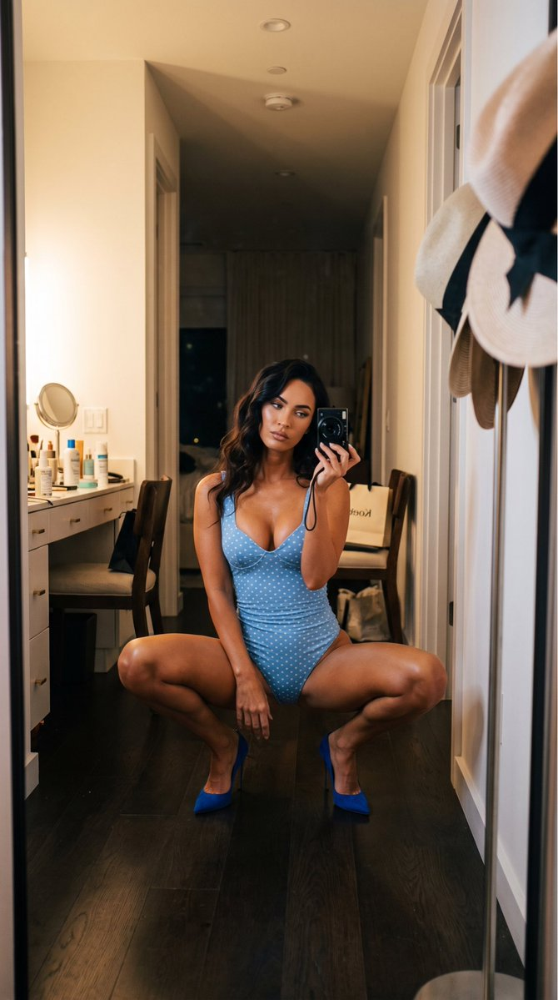
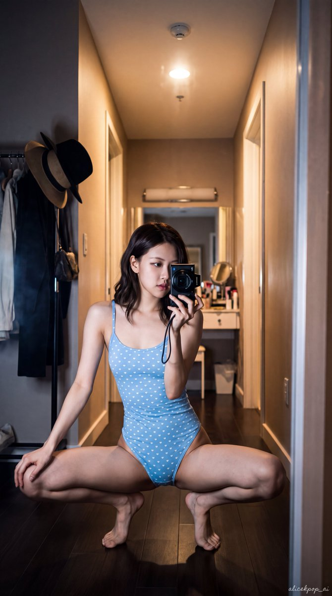
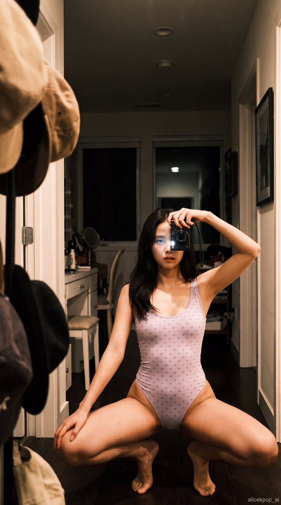
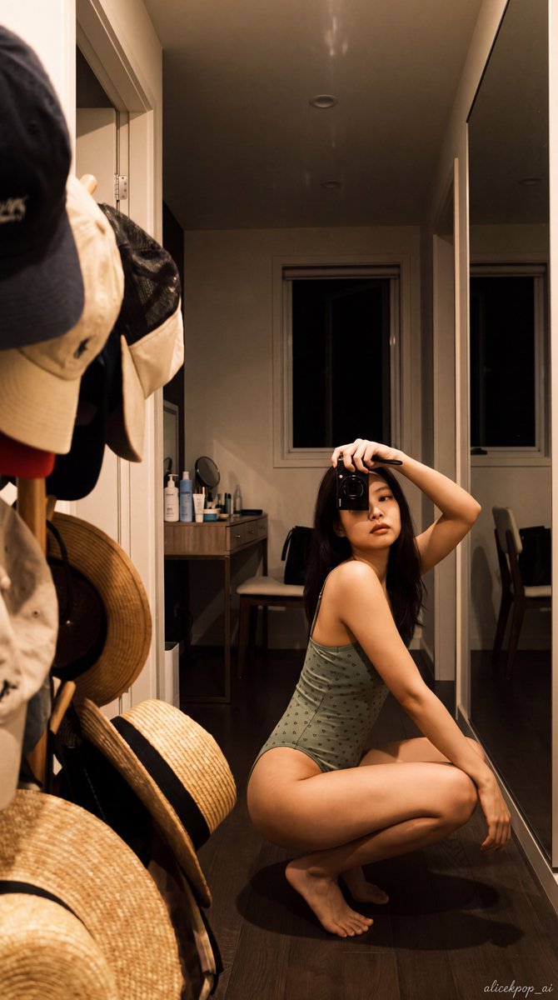
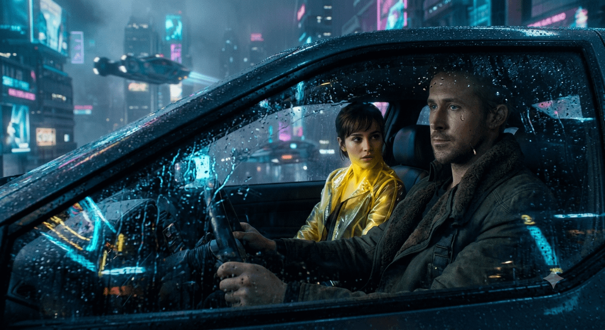

# Nano Banana · Prompt 资料库 · Leadde.ai

[](README.md) [](README_zh.md) [](README_zh-TW.md) [](README_ja-JP.md) [](README_ko-KR.md) [](README_th-TH.md) [](README_vi-VN.md) [](README_hi-IN.md) [](README_es-ES.md) [-lightgrey)](README_es-419.md) [](README_de-DE.md) [](README_fr-FR.md) [](README_it-IT.md) [-lightgrey)](README_pt-BR.md) [](README_pt-PT.md) [](README_tr-TR.md)

**Best for:** Nano Banana prompts for reference-image editing, product consistency, character continuity, and rapid iteration.

For PDF, PPT, SOP, training, and multilingual video workflows:
[Awesome Document-to-Video](https://github.com/LeaddeOpenLab/awesome-document-to-video)

> **每日更新，精选高质量提示词**

发现用于 AI 图像、视频与 3D 创作的完整提示词。按风格浏览，切换多语言版本，查看原作者与作品来源。

[探索 Leadde.ai →](https://leadde.ai/?utm_source=github&utm_medium=readme&utm_campaign=prompt-library&utm_content=nano-banana)

## 认识 Leadde.ai

Leadde.ai 帮助团队将文档、幻灯片和文字转化为 AI 商业视频，适用于培训、员工入职和营销。

给仓库点亮 Star，关注每日精选提示词，持续获取创作灵感。

**19** 条内容 · 最新收录: **2026-09-12**

<a name="catalog"></a>

## 分类目录

[摄影](#category-photography) · [电影 / 电影剧照](#category-cinematic-film-still) · [3D 渲染](#category-3d-render) · [复古 / 怀旧](#category-retro-vintage) · [赛博朋克 / 科幻](#category-cyberpunk-sci-fi) · [其他](#category-other)

<a name="all-prompts"></a>

<a name="category-photography"></a>

## 摄影

<a name="prompt-2098763429636907474"></a>

### 卧室走廊镜前自拍提示词，展现身穿天蓝色连体衣与高跟鞋的女性低蹲自拍身姿及真实室内背景细节。

作者：[@KeorUnreal](https://x.com/KeorUnreal) · [查看 X 原帖](https://x.com/KeorUnreal/status/2098763429636907474)

摄影 · 人像 / 自拍 · 角色 · 建筑 / 室内设计 · 摘要 / 背景 · 已推流

查看 X 原帖：[@alicekpop\_ai](https://x.com/alicekpop_ai) · [查看 X 原帖](https://x.com/alicekpop_ai/status/2096625354505097451)

**概括:** 卧室走廊镜前自拍提示词，展现身穿天蓝色连体衣与高跟鞋的女性低蹲自拍身姿及真实室内背景细节。













**提示词**

```text
逼真写实的 9:16 竖版特写镜前自拍，夜晚狭窄的卧室走廊中有一位年轻的美国成年女孩 Sadie Sink。中长款深色波浪卷发垂落在一侧肩膀上，温暖的金古铜色肌肤，自然妆容，神情平静地看着镜子。她呈低蹲姿势，双膝分开且双腿分得很开，脚后跟微抬，躯干基本挺直，右手搭在大腿上。她身穿一件贴身的天蓝色连体紧身衣，饰有微小的印花星星图案，配有宽肩带、深领口和高叉裤腿。脚穿亮电光蓝高跟鞋。她的左手在面部高度拿着一台小型紧凑型相机。深色木地板，背景中有摆满护肤品瓶的梳妆台、几把椅子，某处有一个写有“Keor”的包，前景衣帽架上有几顶虚焦的优雅帽子。温暖的室内光线搭配微弱的相机闪光灯，略带颗粒感，具有抓拍智能手机质感。
```

[↑ 返回分类目录](#catalog)

---

<a name="prompt-2097623415939076175"></a>

### 高级皮革制品与腕表营销活动摄影提示词模板。指定了强调厚重光影与匠人细节的静物构图。

作者：[@AIGuideNote](https://x.com/AIGuideNote) · [查看 X 原帖](https://x.com/AIGuideNote/status/2097623415939076175)

海报 / 传单 · 摄影 · 产品 · 已推流

**概括:** 高级皮革制品与腕表营销活动摄影提示词模板。指定了强调厚重光影与匠人细节的静物构图。


**提示词**

```text
【商品与营销活动信息】
・宣传文案: {goldText}
・品牌标语: {subtext}
・目标产品: {products}

【画质・视觉表现・构图规范】
・风格: 高端奢华品牌目录或奢华杂志跨页的静物（Still Life）商业产品摄影。
・主体: 放置在具有深邃质感的复古皮革或优质深色调纹理之上的{products}。细腻丰富地展现出彰显工匠手工艺的细节（如缝线、金属拉丝工艺等）。
・光影与色彩: 以深沉的深棕色、黑色与黄铜金为主色调的调色板。琥珀色调的温暖侧光，经典而厚重的阴影。
・文字排版（面向 GPT-image / Nano Banana Pro）: 采用金色纤细字体，将文本 {goldText} 和 {subtext} 作为排版元素低调点缀在画面沉稳雅致的位置。

【排版及输出严格限制（必须遵守）】
・请将完成的设计本身完整填满整个画面输出。设计内部的背景与场景描摹（墙面、空间、阴影等）可遵循正文指示。
・禁止事项：将完成的海报装入相框的照片、贴在墙上的照片、置于桌面或纸张上的样机（mockup）照片、纸张边缘的透视扭曲及投影阴影。
・Output the finished flat 2D design itself, filling the entire canvas. Scene elements inside the design (walls, rooms, shadows) described above are allowed. Absolutely NO photo-of-a-poster mockups: no picture frames, no poster-on-wall or poster-on-desk shots, no perspective warp or drop shadow around the artwork's edges.

・纵横比: --ar 3:4
```

[↑ 返回分类目录](#catalog)

---

<a name="prompt-2097600395073966528"></a>

### 暮色加油站旁靠着奥迪轿车的健美男子肖像，背景为雪山。

作者：[@pictsbyai](https://x.com/pictsbyai) · [查看 X 原帖](https://x.com/pictsbyai/status/2097600395073966528)

摄影 · 人像 / 自拍 · 角色 · 风景 / 自然 · 摘要 / 背景 · 已推流

**概括:** 暮色加油站旁靠着奥迪轿车的健美男子肖像，背景为雪山。


**提示词**

```text
一位自信、健美的年轻男子位于画面正中央，带着内敛的抿嘴微笑，眉头舒展，正视镜头，其富有质感的微卷中分发丝反射出明亮的高光。他身穿修身的黑色T恤和黑色长裤，特意双臂交叉抱胸以突出肌肉线条；左手自然搭在右侧二头肌上，手指微微卷曲，展示出一条清晰可见的粗银色链条手镯。他面向镜头，斜倚在前排一辆拥有无暇光泽黑车漆的奥迪轿车旁，前翼子板上的S-line徽标隐约可见。右侧中景是一座有些磨损的加油机，拥有白黄相间的外壳和绿黑相间的油枪，坐落在坚实的深灰色混凝土地面上。他上方是一个饱经风霜的工业顶棚，采用带有水平波纹的哑光浅米色金属板，嵌有明亮的方形嵌入式照明灯具。极远处的背景中，巍峨陡峭、崎岖的岩石山峰覆着斑驳的白雪，在纵深空间中勾勒出壮丽的轮廓。整幅画面笼罩在深蓝色的暮光天空下，营造出高对比度且富有情绪的氛围，以深黑与暮光蓝组成的冷色调分裂互补色为主，并由暖黄白色的光斑点缀穿透。来自顶棚的高方向性强硬实用光源与暮色环境光交融，在他的下巴下方、双臂下方以及汽车底盘投下浓黑、硬朗且边缘清晰的阴影，同时在他颧骨、鼻梁及汽车引擎盖上反射出明亮的高光。这幅清晰锐利的肖像采用35mm镜头、f/2.8光圈、ISO 800和1/125秒的参数以写实数码照片风格拍摄，将电影级汽车美学与现代社交媒体生活方式风格完美融合，并通过冷色调阴影、面部轻微提亮以及车身反光处的拉升高光进一步强化，以3:4的画幅比例精美呈现。
```

[↑ 返回分类目录](#catalog)

---

<a name="prompt-2097478436105384108"></a>

### 一个定格动画参考照片提示词，特色是深棕色土壤中手工制作的哑光粘土珊瑚粉色大波斯菊，搭配温暖的奶油色背景，并规定了精确的坐标、相机角度和粘土质感细节。

作者：[@higgsfield](https://x.com/higgsfield) · [查看 X 原帖](https://x.com/higgsfield/status/2097478436105384108)

摄影 · 已推流

**概括:** 一个定格动画参考照片提示词，特色是深棕色土壤中手工制作的哑光粘土珊瑚粉色大波斯菊，搭配温暖的奶油色背景，并规定了精确的坐标、相机角度和粘土质感细节。


**提示词**

```text
创作一张正方形定格动画参考照片，非分镜故事板：在深棕色土壤中有一朵手工制作的哑光粘土珊瑚粉色大波斯菊，背景为温暖的奶油色。机位锁定为平视低机位，70mm微距，正交视觉感。土壤填充底部22%，在 (50%,79%) 处达到最高点；居中的花茎从 (50%,80%) 延伸至位于 (50%,33%) 的花心。添加恰好两片绿叶，以及宽度占35%的花头，带有恰好10片珊瑚色花瓣和有质感的金色花心。包含微妙的指纹、泥土碎屑和几颗小卵石。使用柔和的左上方光照和固定的阴影。保持整朵花完全可见，相机和土壤保持静止以便进行动画制作。无花盆、多余植物、角色、昆虫、手、文字、水印、边框或网格。
```

[↑ 返回分类目录](#catalog)

---

<a name="prompt-2097238007426490758"></a>

### 一张高端生活方式闪光摄影作品，展现了一位肤色黝黑、穿着解开扣子的黑色衬衫并戴着墨镜的时尚男士，在沿海黄昏时分伫立于无边泳池旁。

作者：[@pictsbyai](https://x.com/pictsbyai) · [查看 X 原帖](https://x.com/pictsbyai/status/2097238007426490758)

摄影 · 人像 / 自拍 · 角色 · 已推流

**概括:** 一张高端生活方式闪光摄影作品，展现了一位肤色黝黑、穿着解开扣子的黑色衬衫并戴着墨镜的时尚男士，在沿海黄昏时分伫立于无边泳池旁。


**提示词**

```text
一位英俊的年轻男子，拥有健康发亮的小麦色皮肤，以自信、端庄的姿态直面镜头，肩膀向后放松以舒展胸膛。他穿着一件解开纽扣的黑色长袖衬衫，戴着一条银色古巴链项链和完全遮挡住双眼的黑色旅行者风格太阳镜，与他严肃而中性的表情完美相称。他的棕色中长发被打造成向后梳理的背头流线造型，长度垂至颈背，利落地别在耳后，前额处的发髻略带蓬松感，两侧紧贴头部。头发呈现出深金与棕色发根过渡到更浅金色的发梢，被厚重的湿发质感发蜡紧密定型，呈现出光泽且有层次的结构感，发丝略有分束，发际线带有自然的参差不齐感，头右侧可见细微的碎发。在他的下躯干处，双手以放松的方式轻轻相扣；左手垫在下方，手指自然向内弯曲，右手轻轻握住左指关节，展示出银色戒指和银链手镯。他站在由斜向铺陈的褪色暖灰与棕色木板制成的露台上，中景处是一座无边泳池，纯净深沉的池水倒映着绚丽的暮光天空和他身上的深色衣物。在中景右侧，带有建筑立柱的经典石质栏杆在水面上勾勒出剪影，而上方前景处的一根松树枝轻垂入画框，其深色松针捕捉到了微弱的闪光边缘。深邃的远景延伸为一片开阔的海岸景观，暗色剪影的山丘在充满氛围感的薄暮天空中隆起，最左侧海岸线上稀疏的沿海建筑灯火散发着柔和的光芒。场景采用混合光照明，其特征是硬质、直接的机顶闪光灯将高度定向的暖金色光芒投射在主体身上，在他的前额、鼻梁、颧骨、胸前、双手以及金属首饰上形成明亮的镜面高光。这种强烈生硬的闪光在他的下巴下方、衬衫褶皱内以及相扣的双手下方投下深黑、短小而紧实的阴影，与背景中阴郁、低调的薄暮环境光形成鲜明对比，背景从洋红色紫霞般的日落暖意平滑过渡为深邃幽暗的藏青色夜空。暖色闪光色调与冷调、低饱和度的大气蓝紫所形成的分裂互补色调，唤起了一种神秘而尊贵的高端度假胜地氛围。照片以高端狗仔抓拍生活方式图像的写实数码摄影风格拍摄，采用35毫米至50毫米等效镜头在视线高度正面直拍，运用约1/60秒的慢速同步快门，使极其锐利的主体与略显柔和、带有数码噪点的暗光背景达成平衡。后期处理强调略微压暗的暗部以实现高对比度，并强化了主体面部和珠宝的锐度与清晰度，整个引人注目的构图被定格在3:4的竖构图肖像画幅中。
```

[↑ 返回分类目录](#catalog)

---

<a name="category-cinematic-film-still"></a>

## 电影 / 电影剧照

<a name="prompt-2098365190282805417"></a>

### 雨夜车窗透视下的赛博朋克侦探与黄衣女子电影质感场景。

作者：[@SheBuildsAI\_](https://x.com/SheBuildsAI_) · [查看 X 原帖](https://x.com/SheBuildsAI_/status/2098365190282805417)

电影 / 电影剧照 · 赛博朋克 / 科幻 · 角色 · 车辆 · 已推流

**概括:** 雨夜车窗透视下的赛博朋克侦探与黄衣女子电影质感场景。



**提示词**

```text
{
  "title": "赛博朋克侦探",

  "image_description": "透过被雨水浸湿的车窗所看到的具有电影质感的赛博朋克场景。霓虹倒影在玻璃上跃动，一名英俊的未来派侦探身穿厚重的深色大衣坐在驾驶座上。一名身穿发光半透明黄色夹克的女子望向他。背景中，飞行器在雾气弥漫的未来城市中穿梭。",

  "characters": [
    {
      "role": "未来侦探",
      "position": "驾驶座",
      "appearance": "英俊，神情严肃，厚重深色大衣",
      "focus": "清晰对焦"
    },
    {
      "role": "神秘女子",
      "position": "副驾驶座",
      "appearance": "深色头发，发光的半透明黄色夹克",
      "expression": "静静注视着侦探",
      "focus": "略柔和对焦"
    }
  ],

  "setting": {
    "location": "未来载具内部",
    "cityscape": "雾气笼罩的赛博朋克特大城市",
    "background_elements": [
      "飞行载具",
      "霓虹广告牌",
      "布满雨滴的玻璃",
      "全息灯光"
    ]
  },

  "cinematography": {
    "shot_type": "中近景",
    "camera_angle": "平视角度",
    "lens": "50毫米变形镜头",
    "depth_of_field": "浅景深",
    "composition": "电影剧照"
  },

  "lighting": {
    "type": "电影级光效",
    "effects": [
      "霓虹倒影",
      "体积光",
      "雨滴折射",
      "柔和环境光晕"
    ]
  },

  "mood": [
    "阴郁沉郁",
    "神秘",
    "未来感",
    "富有情绪张力"
  ],

  "color_palette": [
    "蓝色",
    "青色",
    "黄色"
  ],

  "quality": {
    "style": "好莱坞大片风格",
    "realism": "超逼真写实",
    "resolution": "8K",
    "details": [
      "完美倒影",
      "逼真面孔",
      "胶片颗粒感",
      "体积雾",
      "逼真景深",
      "获奖级摄影构图",
      "IMAX品质",
      "电影叙事感",
      "杰作"
    ]
  }
}
```

[↑ 返回分类目录](#catalog)

---

<a name="prompt-2097564694974541836"></a>

### 在城市环境中创作一张具有电影质感、超逼真的街头潮流时尚大片肖像。

作者：[@shushant\_l](https://x.com/shushant_l) · [查看 X 原帖](https://x.com/shushant_l/status/2097564694974541836)

电影 / 电影剧照 · 人像 / 自拍 · 城市风光 / 街道 · 已推流

**概括:** 在城市环境中创作一张具有电影质感、超逼真的街头潮流时尚大片肖像。


**提示词**

```text
为我创作一张电影质感、超逼真的街头潮流时尚大片肖像，精准保留我的面部特征、容貌细节、肤色、发型和自然比例。为我搭配高端现代街头服饰，包含宽松叠穿造型与低调配饰，以自信松弛的姿态置身于拥有混凝土建筑、质感墙面和低调城市细节的街头环境中。运用戏剧性的自然光线、柔和阴影、浅景深、真实的皮肤肌理、精致的高级中性色调、细腻的胶片颗粒、高级时尚杂志构图、专业摄影水准以及电影级调色。让整张画面呈现真实自然、随性酷飒、极简唯美与大片质感，宛如使用全画幅相机搭配85mm镜头拍摄的奢华街头服饰广告大片。
```

[↑ 返回分类目录](#catalog)

---

<a name="prompt-2097549831489405424"></a>

### 包含高山湖泊、码头旅行者和杂志排版的 9:16 电影感高山旅行海报提示词。

作者：[@aniyaintel](https://x.com/aniyaintel) · [查看 X 原帖](https://x.com/aniyaintel/status/2097549831489405424)

海报 / 传单 · 电影 / 电影剧照 · 风景 / 自然 · 文本 / 排版 · 已推流

**概括:** 包含高山湖泊、码头旅行者和杂志排版的 9:16 电影感高山旅行海报提示词。


**提示词**

```text
创作一张9:16竖版构图的高端超写实电影感旅行编辑海报。

场景：令人惊叹的高山湖泊，湖水清澈碧绿，四周环绕着巍峨的雪山、茂密的常绿松林和陡峭的岩石绝壁。湖面完美倒映着山峦与天空。右侧湖岸附近坐落着一座质朴的小木屋，而前景中的木码头旁系着一艘传统木质划艇。

在前景正中央，展现一位独自旅行者的背影，坐在木码头上，平静地望向远山。旅行者头戴棕色宽檐帽，身穿焦橙色户外夹克，背着米色/棕色徒步背包，穿着中性色户外服饰。人体比例自然真实，衣服纹理细腻微妙。

构图：电影感广角摄影，旅行者位于中下方，划艇位于右下方，开阔的湖泊与雪山占据背景的主导地位。景深强烈，透视自然，层次分明的景观，散发着宁静而充满探索欲的气息。

光影：柔和的金色晨光，散落着朵朵白云的明媚蓝天，山峦周围弥漫着微妙的大气薄雾，逼真的阳光与自然阴影。色彩丰富而真实，碧绿的湖水，大地棕色的前景，郁郁葱葱的绿色森林，冷色调的蓝色山体。

排版：在画面上方添加优雅的旅行海报排版文字：

小号大写文字：“COLLECT”
大号时尚手写/手写草书文字：“Moments”
下方中号大写文字：“NOT THINGS”
极简装饰性水平线条搭配微小爱心符号
小号大写标语：“TRAVEL • EXPLORE • LIVE”

使用考究的深水鸭蓝字体，间距整洁，高端编辑设计风格，层次均衡，文本清晰易读，点缀雅致克制的极简装饰。

风格：奢华旅行杂志，电影质感摄影，超细腻，逼真写实，专业单反摄影，HDR，真实水面反射，自然的皮肤/衣物纹理，微妙的胶片色彩调校，大气深度感，高级Pinterest旅行美学，充满灵感与宁静的氛围。

避免：变形的人物、多余的肢体、不切实际的建筑、过度饱和、模糊的细节、卡通外观、虚假质感的水体、杂乱的排版、徽标、水印。
```

[↑ 返回分类目录](#catalog)

---

<a name="prompt-2097524090735075539"></a>

### 高端电影感时尚肖像提示词，描绘了一位优雅女性在温暖的金色光线中置身于巨大的鲜艳红色虞美人花丛中。

作者：[@codewithhajra](https://x.com/codewithhajra) · [查看 X 原帖](https://x.com/codewithhajra/status/2097524090735075539)

摄影 · 电影 / 电影剧照 · 人像 / 自拍 · 角色 · 时尚单品 · 已推流

**概括:** 高端电影感时尚肖像提示词，描绘了一位优雅女性在温暖的金色光线中置身于巨大的鲜艳红色虞美人花丛中。


**提示词**

```text
一张令人惊叹的超逼真电影感时尚肖像，展现了一位优雅的成年女性被巨大的鲜艳红色虞美人花所簇拥，定格于梦幻般的时尚编辑级花园环境中。她拥有白皙透亮的肌肤与真实自然的肌理，面颊泛着淡淡红晕，面部轮廓精致对称，拥有一双富有表现力的浅蓝灰色眼睛、精细的双眉、清晰分明的睫毛、优雅笔直的鼻梁以及自然饱满富有光泽的裸粉色双唇。她的神情平静、安详且极具内敛的魅力，直视镜头。
她那头金黄色的长发整齐地中分并光滑地向后拢起，丝丝缕缕细腻的发丝迎光生辉。巨大的绯红色虞美人花映衬着她脸部的左侧，并部分遮掩了她的秀发，前景与背景中更多巨大的红花共同构成了富有戏剧张力的花卉构图。
她身着一袭精致的柔和淡粉色高级定制礼服，由轻盈的百褶雪纺/薄纱制成。礼服配有环绕颈部、受维多利亚风格启发的高立荷叶边夸张立领，点缀着精致的垂直褶皱、富有体积感的雕塑感肩部，以及流淌倾泻在画面下方的半透明飘逸面料层。轻柔的面料捕捉着阳光，营造出柔和的高光、阴影、褶皱和微妙的通透质感。
温暖的金色时刻夕阳从侧面照亮她的面庞，营造出泛着蜜桃粉色微光的氛围、透亮细腻的皮肤高光、柔和的面部阴影以及来自花朵的浓郁红色反光。在她身后，是清澈的柔淡蓝天，地平线隐约模糊，连绵延伸着无尽的红花田野。
构图：特写至中景时尚肖像，面部居中，4:5纵向取景构图，花朵极具张力地环绕烘托主体，浅景深，前景花瓣柔和虚化以增加空间纵深感，主体与背景之间呈现电影级的空间分离感。
风格：高端奢华时尚大片、梦幻浪漫的纯艺术摄影、超逼真、考究的调色、真实的皮肤肌理、逼真的面料物理动态、精致复杂的的花卉细节、柔和的大气景深、电影级光影、细腻的胶片颗粒、HDR、8K细节、85mm人像镜头、f/1.8、专业影棚级摄影质感。
反向提示词：卡通，动漫，插画，塑料感皮肤，浓妆，扭曲的面容，不对称的眼睛，畸变的手，多余的手指，重复的花朵，不自然的头发，过度饱和的色彩，模糊的面部，低分辨率，生硬的阴影，人造皮肤，文本，水印，标识。
```

[↑ 返回分类目录](#catalog)

---

<a name="prompt-2097237465887338994"></a>

### 标题： 高端气泡柠檬饮品产品商业广告分镜脚本 格式： • 单页高端分镜脚本 • 3:4 竖屏比例 • 奢华饮品广告企划 • 8个聚焦产品的电影级镜头 • 产品始终作为视觉核心主角 • 高端商业演示风格

作者：[@Strength04\_X](https://x.com/Strength04_X) · [查看 X 原帖](https://x.com/Strength04_X/status/2097237465887338994)

漫画 / 故事板 · 产品营销 · 电影 / 电影剧照 · 人像 / 自拍 · 产品 · 食品 / 饮料 · 已推流

**概括:** 标题： 高端气泡柠檬饮品产品商业广告分镜脚本 格式： • 单页高端分镜脚本 • 3:4 竖屏比例 • 奢华饮品广告企划 • 8个聚焦产品的电影级镜头 • 产品始终作为视觉核心主角 • 高端商业演示风格


**提示词**

```text
标题：
高端气泡柠檬饮品产品商业广告分镜脚本

格式：
• 单页高端分镜脚本
• 3:4 竖屏比例
• 奢华饮品广告企划
• 8个聚焦产品的电影级镜头
• 产品始终作为视觉核心主角
• 高端商业演示风格

页眉：
• 醒目的现代排版字体
• 信息卡片：
  - 时长：20秒
  - 风格：高速电影级饮品商业广告
  - 产品：气泡柠檬饮品
  - 音频：气泡滋滋声 + 冰块碎裂声 + 液体 ASMR
• “为何选择此风格”板块
• 水晶白、柠檬黄与银色的美学色调
• 极简柑橘风图形点缀

分镜脚本：
1. 冰镇瓶身独立伫立，覆满厚重的凝结水珠
2. 水滴顺着瓶身滑落的极致微距特写
3. 开瓶瞬间，碳酸气泡极具戏剧性地喷涌而出
4. 气泡饮品以受控的液体飞溅姿态向上迸发
5. 柠檬切片在气泡液体中旋转穿梭
6. 冰块以超慢动作落入水晶玻璃杯中
7. 极致微距展现数以千计的碳酸气泡在饮品中升腾
8. 最终主角定格镜头：瓶身、玻璃杯、柠檬切片以及定格水花环绕着产品

每个画格：
• 镜头编号
• 时长徽标
• 运镜方向
• 画面视觉
• 动作
• 产品细节

摄影：
120fps 高速液体摄影，极致微距，定格水花，旋转柠檬片，戏剧性背光，凝结水珠特写，平滑 360° 产品环绕运镜。

风格：
超写实高端饮品商业广告，晶莹剔透的液体，极具爆发力的碳酸气泡，符合物理特性的水滴
```

[↑ 返回分类目录](#catalog)

---

<a name="category-3d-render"></a>

## 3D 渲染

<a name="prompt-2097629839209758892"></a>

### 一份伪代码风格的提示词，用于生成献给著名思想家的 2x2 网格 3D 大理石圣殿立体模型透视画。

作者：[@Gdgtify](https://x.com/Gdgtify) · [查看 X 原帖](https://x.com/Gdgtify/status/2097629839209758892)

3D 渲染 · 已推流

**概括:** 一份伪代码风格的提示词，用于生成献给著名思想家的 2x2 网格 3D 大理石圣殿立体模型透视画。


**提示词**

```text
2x2 网格，16:9，为 4 位著名的思想家、作家、发明家执行此操作：class Mind_As_Shrine_Diorama:
    def __init__(self, thinker="[THINKER_NAME]"):
        self.canvas = "纯白摄影棚背景下独立的、自成一体的 3D 纪念碑式雕塑小品。"
        self.material_palette = "抛光白色卡拉拉大理石、拉丝黄铜、玻璃透镜和发光的宇宙景观。"

    def construct_face_and_hair_arch(self):
        # 核心视觉双关：头发化作建筑
        hair_motif = infer_iconic_hair_or_silhouette(self.thinker)
        name_arch = f"巨大的 3D 镀金大理石字母拼写出 '{self.thinker.upper()}'，直接融入华丽的巴洛克漩涡云拱门中，展现出夸张的 {hair_motif}。"
        face_core = f"中心：从石质地面浮现的逼真 {self.thinker} 雕刻大理石面孔，戴着圆形眼镜，玻璃镜片上显示着他们的主要公式/符号。"
        return [name_arch, face_core]

    def construct_internal_brain_chambers(self):
        # AI 自动推断：将他们的思想遗产分成两个独立的脑室
        theory_left = infer_primary_breakthrough(self.thinker) # 例如：狭义相对论、逻辑门、自然选择
        theory_right = infer_secondary_breakthrough(self.thinker) # 例如：广义相对论、量子态、光学
        
        chamber_left = f"左上脑室：写有 {theory_left} 真实方程式的微型黑板、机械思想实验模型（如火车、钟表、齿轮）以及藏有微型书籍的图书馆。"
        chamber_right = f"右上脑室：展示 {theory_right} 的深邃宇宙景观，配有光学仪器、原子模型和体积化的引力井/漏斗。"
        return [chamber_left, chamber_right]

    def construct_base(self):
        quote = infer_signature_quote(self.thinker)
        return f"带黄铜铆钉的阶梯状圆形大理石基座、一本写有手写文本的打开手稿，以及刻有以下内容的弧形黄铜铭牌：'{quote}'。"

render_sculptural_masterpiece(Mind_As_Shrine_Diorama())
```

[↑ 返回分类目录](#catalog)

---

<a name="category-retro-vintage"></a>

## 复古 / 怀旧

<a name="prompt-2097696144163778745"></a>

### 描绘昭和复古街景与老式咖啡馆的手绘风温馨城市生活杂志封面设计提示词。

作者：[@AIGuideNote](https://x.com/AIGuideNote) · [查看 X 原帖](https://x.com/AIGuideNote/status/2097696144163778745)

复古 / 怀旧 · 城市风光 / 街道 · 已推流

**概括:** 描绘昭和复古街景与老式咖啡馆的手绘风温馨城市生活杂志封面设计提示词。


**提示词**

```text
【杂志信息】
・杂志名称: {magazineTitle}
・本期特辑主题: {featureTopic}
・期号标注: {issueName}

【画质・表现・构图要求】
・风格: 描绘日本复古街景与生活方式的温和笔触插画（类似《OZ magazine》或地方自治体的公关宣传杂志风格）。
・主体: 带有着昭和复古风貌的怀旧商店街街角、老式咖啡馆、在小巷漫步的人们，或猫咪静坐伫立的景致。
・色彩与色调: 温暖的粉彩柔和色调，略带褪色质感的油墨质感。手绘风的温和纹理。
・排版设计（面向 GPT-image / Nano Banana Pro）: 杂志Logo“{magazineTitle}”以温暖的手绘风大字体排列在顶部，中央或下方利落排布着“{featureTopic}”与“{issueName}”。

【排版及输出的严格限制（必须遵守）】
・请将完成的设计本身填满整个画面输出。设计内部的背景与场景描绘（墙面、空间、阴影等）可遵循正文指示。
・禁止事项：将完成的海报装入相框的照片、贴在墙上的照片、摆放在桌面或纸张上的样机模型（mockup）照片、纸张边缘的透视扭曲或投影阴影。
・Output the finished flat 2D design itself, filling the entire canvas. Scene elements inside the design (walls, rooms, shadows) described above are allowed. Absolutely NO photo-of-a-poster mockups: no picture frames, no poster-on-wall or poster-on-desk shots, no perspective warp or drop shadow around the artwork's edges.

・纵横比: --ar 3:4
```

[↑ 返回分类目录](#catalog)

---

<a name="category-cyberpunk-sci-fi"></a>

## 赛博朋克 / 科幻

<a name="prompt-2097435473043931201"></a>

### 描绘悬浮于云海之上、位于巨大发光宇宙环状星云之下的漂浮发光城市的提示词。

作者：[@churvikv](https://x.com/churvikv) · [查看 X 原帖](https://x.com/churvikv/status/2097435473043931201)

赛博朋克 / 科幻 · 已推流

**概括:** 描绘悬浮于云海之上、位于巨大发光宇宙环状星云之下的漂浮发光城市的提示词。


**提示词**

```text
Prompt 1:
一幅迷人的数字插画，描绘了一座悬浮在梦幻夜空下蓬松夜云海之上的城市景观。在前景中，密密麻麻的高耸摩天大楼林立，窗户中透出温暖的金色光芒，构筑起一座发光的城市天际线。这座城市似乎坐落在一层厚重、翻滚的深蓝色和灰色云层上，一直延伸向远方。在城市上方，夜空演变成一场天体奇观：一个由色彩斑斓的星云构成的巨大发光环，环绕着一片黑暗且繁星密布的虚空。星云闪耀着深紫、电光蓝和炽烈橙色的鲜艳色调，点缀着遥远闪烁的繁星与星座，营造出一种梦幻般、超凡脱脱的氛围。

Prompt 2:
暮色之中，一座未来主义大都市优雅悬浮于无垠的翻滚深灰浓云之海上的壮丽竖幅构图全景。延绵广阔的城市天际线展现出无数高耸的摩天大楼，发光的窗户将温暖的琥珀色和橙色光线洒在下方的城市景观中。画面上方占据主导地位的是一个宏伟的宇宙之环，那是由鲜艳紫色、深蓝色和灿烂温暖金色调组成的环形发光星云，散落在漆黑夜空中无数闪烁的星星和遥远星系之间。构图平衡而庄严，下部前景由深色云层奠定基调，与上方璀璨的宇宙奇观形成鲜明对比。光影超现实而空灵，将城市灯光的温暖人造光芒与星云的宇宙冷光融为一体。氛围静谧、令人敬畏且神秘，唤起一种星际奇迹与都市孤独感。柔软饱满云朵的细腻质感、摩天大楼光滑的玻璃与钢铁建筑，以及星光璀璨的宇宙尘埃，共同构成了一幅高对比度、极具视觉冲击力的画面。
```

[↑ 返回分类目录](#catalog)

---

<a name="category-other"></a>

## 其他

<a name="prompt-2097803184903274848"></a>

### 面向日本时尚品牌，巧妙利用自然光与混凝土、绿植的时尚杂志大片级人像提示词模板。

作者：[@AIGuideNote](https://x.com/AIGuideNote) · [查看 X 原帖](https://x.com/AIGuideNote/status/2097803184903274848)

人像 / 自拍 · 时尚单品 · 已推流

**概括:** 面向日本时尚品牌，巧妙利用自然光与混凝土、绿植的时尚杂志大片级人像提示词模板。


**提示词**

```text
【品牌概念】
・视觉概念: {concept}
・拍摄地点: {location}

【造型设计】
・穿搭・服饰: {outfitStyle}

【画质・视觉呈现・构图规范】
・风格: 极简而高品质的日本时尚・生活方式品牌Lookbook主视觉大片。
・主体: 静静伫立于自然光下的模特，穿着{outfitStyle}。微风拂动的发丝与衣物褶皱，神情宁静自然。
・背景: 树影婆娑的老旧日式房屋走廊，或将混凝土与绿植优美交融的{location}场景。
・光影・色彩: 清晨或傍晚柔和清透的斑驳光影，低对比度的淡雅高级大地色系（微调灰、橄榄绿、自然米色）。
・排版文字（面向 GPT-image / Nano Banana Pro）: 文字“{concept}”及“{location}”以极细且现代的无衬线字体静静排列在画面的留白处。

【排版及输出严格限制（必须遵守）】
・请将完成的设计本身完整铺满整个画布输出。设计内部的背景与场景描绘（墙壁・空间・阴影等）可遵循正文指示。
・禁止事项：将完成的海报装入画框的照片、贴在墙上的状态照片、摆放在桌子或纸张上的样机模型（Mockup）照片、纸张边缘的透视扭曲及投影。
・Output the finished flat 2D design itself, filling the entire canvas. Scene elements inside the design (walls, rooms, shadows) described above are allowed. Absolutely NO photo-of-a-poster mockups: no picture frames, no poster-on-wall or poster-on-desk shots, no perspective warp or drop shadow around the artwork's edges.

・纵横比: --ar 16:9
```

[↑ 返回分类目录](#catalog)

---

<a name="prompt-2097775925899436414"></a>

### 黑夜河流上漂浮着纸灯笼的长曝光夜景。

作者：[@dfl\_inc\_jp](https://x.com/dfl_inc_jp) · [查看 X 原帖](https://x.com/dfl_inc_jp/status/2097775925899436414)

风景 / 自然 · 已推流

**概括:** 黑夜河流上漂浮着纸灯笼的长曝光夜景。


**提示词**

```text
#杰作 #写实照片 #风景 #长曝光 #漂浮的纸灯笼 #暗流 #温暖的水面倒影 #午夜寂静
```

[↑ 返回分类目录](#catalog)

---

<a name="prompt-2097709112188641299"></a>

### 黄金时刻秋千上身着蓝色真丝连衣裙的年轻女子肖像。

作者：[@dreamydigiarts](https://x.com/dreamydigiarts) · [查看 X 原帖](https://x.com/dreamydigiarts/status/2097709112188641299)

人像 / 自拍 · 角色 · 时尚单品 · 已推流

**概括:** 黄金时刻秋千上身着蓝色真丝连衣裙的年轻女子肖像。


**提示词**

```text
图像为高分辨率全身纵向纯艺术肖像，采用索尼A1和120mm镜头拍摄，捕捉一位20岁出头、身姿婀娜的超级名模，沐浴在温暖的黄金时刻光芒中，在秋千上寻求慰藉，柔和朦胧的粉彩色调，身着一件钴蓝色真丝连衣裙，梦幻般的氛围，留着飘逸的乌黑长发，大而富有表现力的深褐色双眸，微启的红唇，流露出怀旧与宁静，深思的目光，一抹怀旧之意穿透温暖的氛围，夕阳的最后一缕余晖穿过她凌乱的发丝跃动，处在静谧的时刻。
```

[↑ 返回分类目录](#catalog)

---

<a name="prompt-2097547198523388128"></a>

### 翻译中

作者：[@AIGuideNote](https://x.com/AIGuideNote) · [查看 X 原帖](https://x.com/AIGuideNote/status/2097547198523388128)

产品营销 · 海报 / 传单 · 已推流

**概括:** 翻译中


**提示词**

```text
翻译中
```

[↑ 返回分类目录](#catalog)

---

<a name="prompt-2097548956251168916"></a>

### 身着黑色礼服的优雅女性坐在黑色雕塑椅上的高级时装摄影棚肖像。

作者：[@Elvorya](https://x.com/Elvorya) · [查看 X 原帖](https://x.com/Elvorya/status/2097548956251168916)

人像 / 自拍 · 角色 · 时尚单品 · 已推流

**概括:** 身着黑色礼服的优雅女性坐在黑色雕塑椅上的高级时装摄影棚肖像。


**提示词**

```text
超写实高级时装摄影棚肖像，一位优雅的女性端庄地坐在深炭灰色背景前。她身着一袭精致的黑色单肩缎面礼服，缀有若隐若现的微闪饰物。柔顺笔直的深棕色秀发整齐地梳在双肩之后。精致迷人的妆容：线条柔和立体的眉毛、棕色烟熏眼影、利落眼线、纤长睫毛、温暖腮红、散发自然光泽的肌肤，以及光泽感裸粉色唇妆。她佩戴着优雅的几何形银质水滴耳环、数枚精致的银戒、细手镯和一只小巧的耳夹。

姿势：坐在亮面黑色雕塑感座椅上，一只手臂自然搭在椅上，另一只手轻柔抬起托于下巴下方，手指放松而优雅。修长修剪整齐的指甲涂有光泽黑色甲油。平静、自信地直视镜头，表情成熟精致。

专业奢华美妆摄影，柔和漫射主光，细腻轮廓光，深邃阴影，高对比度，逼真皮肤纹理，细腻面部特征，精致社论质感，电影感氛围，清晰对焦，85mm人像镜头，浅景深，高端时尚杂志美学，照片级写实，4K，竖向构图。
```

[↑ 返回分类目录](#catalog)

---

<a name="prompt-2097482618992570627"></a>

### 关于一条拥有远古与全息羽翼的宇宙巨龙盘旋在现代霓虹都市上空的诗意提示词。

作者：[@ToshiArte](https://x.com/ToshiArte) · [查看 X 原帖](https://x.com/ToshiArte/status/2097482618992570627)

动物 / 生物 · 已推流

**概括:** 关于一条拥有远古与全息羽翼的宇宙巨龙盘旋在现代霓虹都市上空的诗意提示词。


**提示词**

```text
当羽翼记起两岸

巨龙并不选择世纪。
是世纪通过一具由延宕与余晖构成的躯体，
在选择着它自己。
它的一只羽翼拖曳着某座图书馆最后一页未焚的残页，
那座图书馆在纸张学会自己的名字之前便已倾覆。
另一只羽翼正梳理着全息的雨丝，
雨丝来自尚未决意
是要屹立还是沦为传闻的塔楼。
在两翼之间，空气维系着两卷日历，
却遗忘了哪一卷正在流逝。
它的鳞片比“鳞片”这个词本身还要古老。
它们记得尚未被点燃的锻炉的炽热，
以及在另一种叙述中
早已熄灭的群星的冰冷。
符文如同一座城市尚无资格拥有的念头般
浮现又沉没。
每一记光芒的搏动，既是遗存，亦是原型。
下方，街道因已然发生之事、
以及仍在商榷降临之事而湿漉。
霓虹在曾是冰川之耐性的水面上书写，
那水稍后将仅仅是一阵关于干渴的谣传。
地基安歇在森林的静谧之上，
森林依然在梦中以为自己挺拔如初。
广告牌招徕着无数个明天，
那些明天却已在思念尚未降临的暮色。
这生灵的双眼蕴藏着世间唯一诚实的气候：
一只眼是尚不知自己已然终结的记忆的翠绿，
另一只眼则是尚未找到发问之口的疑问的幽蓝。
它们凝视着我们，恰如时间在无人注视时凝视自身那样——
没有怜悯，没有判决，
只有那漫长而肃穆的注视之礼。
我们生活在它飞掠而过的短暂下沉气流中，
那是奇特而仁慈的间隙，
在其中，过去对我们尚未了结，
而未来却已然开始
怀念我们尚未失去的一切。
除却转徙，万物皆无定数：
那是羽翼缓慢而发光的铰链，
它同时属于每一个时刻，
却又完全不属于其中任何一刻。
它留下的薄雾既非终结亦非开端。
那是它们在下一个未知
张开其沉静而必然之手前，
短暂认出彼此的地方。
```

[↑ 返回分类目录](#catalog)

---

[探索 Leadde.ai →](https://leadde.ai/?utm_source=github&utm_medium=readme&utm_campaign=prompt-library&utm_content=nano-banana)
