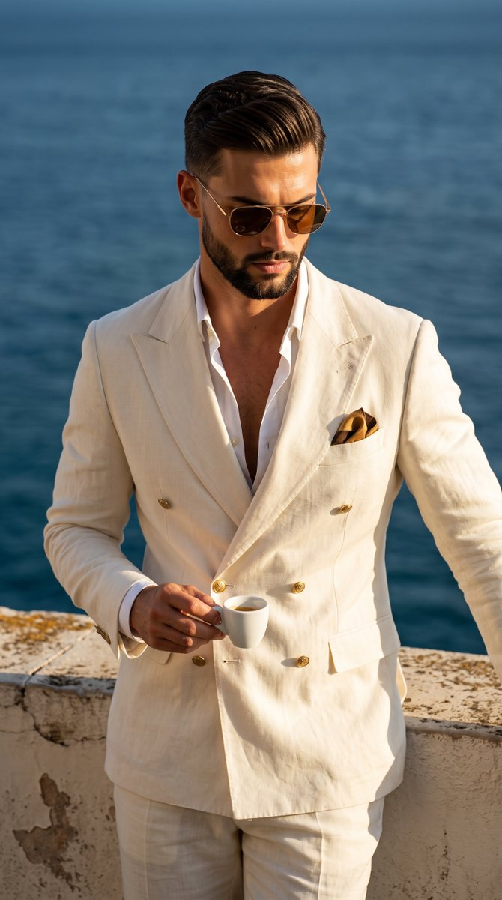

<a name="prompt-2100861885981790532"></a>

### 一位身穿米色亚麻西装的时尚男士，在俯瞰大海的阳光海滨阳台上端着一杯浓缩咖啡。

作者：[@pictsbyai](https://x.com/pictsbyai) · [查看 X 原帖](https://x.com/pictsbyai/status/2100861885981790532)

摄影 · 人像 / 自拍 · 角色 · 风景 / 自然 · 已推流

**概括:** 一位身穿米色亚麻西装的时尚男士，在俯瞰大海的阳光海滨阳台上端着一杯浓缩咖啡。



**提示词**

```text
一位肌肉发达的成年男性散发着成熟精致的男性优雅气质，身穿一套米白色双排扣亚麻西装，饰有金属金色纽扣，胸前口袋里插着一条棕金相间的花纹口袋巾，内搭一件敞开许多扣子的白衬衫。他留着向后梳理的微卷短棕发，神情严肃，嘴唇微闭呈中性，低垂的目光被一副棕色镜片的金色细边太阳镜部分遮挡。他正面对着镜头站立，重心略有偏移，右手抬至下胸前，拇指和食指优雅地捏着一只白色陶瓷浓缩咖啡杯的小手柄。主体位于室外的海滨阳台上，右下角前景靠近一处风化磨损、带有粗糙多孔颗粒状坑洼的暖沙色石膏窗台。在他身后，清澈碧蓝的广阔海洋一直延伸到中景，海面纹理呈现为柔和的模糊虚化。沐浴在来自左上方45度角的强定向暖金自然阳光下，场景形成了强烈的明暗对比：右颧骨、鼻梁、右肩和咖啡杯边缘映着明亮的强烈高光，与下巴下方、敞开衬衫深处、翻领在胸前投下的阴影以及手指在杯子上投射出的生硬深黑阴影形成鲜明反差。米白、深海蓝和暖青铜的互补色调营造出一种沐浴在阳光下的静奢（Quiet Luxury）氛围。采用受意大利里维埃拉（Italian Riviera）男装和老钱风（Old Money）美学深受影响的高度写实时尚编辑数字摄影风格拍摄，使用约f/2.0大光圈的85mm人像镜头，确保主体极度锐利，同时背景具有浅景深效果，并通过高对比度的暖色调调色和细腻的胶片颗粒加以增强，画面完全采用9:16的纵向宽高比构图。
```
